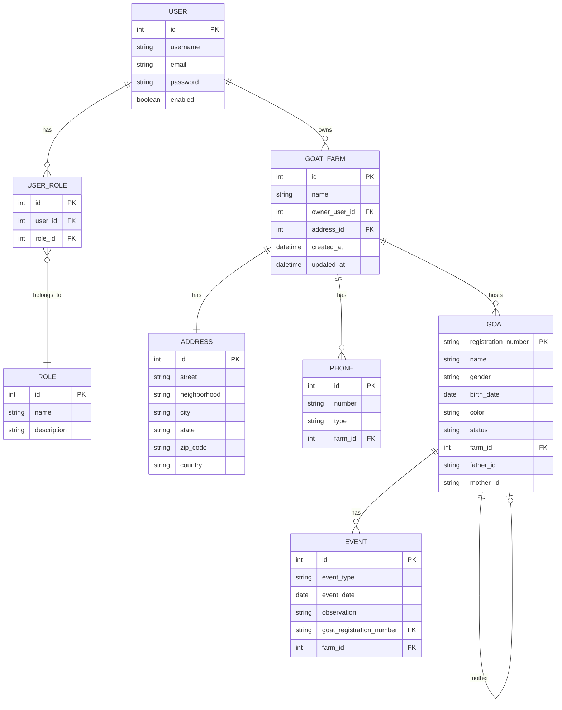

<div align="center">

# 🐐 CapriGestor – Backend

### Sistema completo para gestão de caprinos com arquitetura limpa, segura e escalável

[](https://www.java.com)
[](https://spring.io/projects/spring-boot)
[](https://www.postgresql.org)
[](https://www.docker.com)
<!-- Badge de licença removido até que um arquivo LICENSE seja adicionado -->

[📋 Documentação Técnica](./DOCUMENTACAO_BACKEND.md) • [🖥️ Frontend](https://github.com/albertovilar/caprigestor-frontend) • [📊 Swagger](http://localhost:8080/swagger-ui/index.html)

</div>

---

## 📊 Status do Projeto

> **Em Desenvolvimento** – MVP previsto para **02/10/2025**

---

## 📑 Índice

- [Sobre](#sobre-o-projeto)
- [Funcionalidades](#funcionalidades-principais)
- [Tecnologias](#tecnologias-utilizadas)
- [Arquitetura](#arquitetura-e-módulos)
- [Diagrama do Domínio](#diagrama-do-domínio-mermaid)
- [Pré-requisitos](#pré-requisitos)
- [Instalação](#instalação)
- [Configuração](#configuração)
- [Uso](#como-usar)
- [Perfis de Execução](#perfis-de-execução)
- [Banco de Dados](#banco-de-dados)
- [Segurança](#segurança)
- [API](#api--documentação)
- [Testes](#testes)
- [Docker](#docker)
- [Contribuição](#contribuindo)
- [Licença](#licença)
- [Contato](#contato)

---

## 📖 Sobre o Projeto

**CapriGestor** é uma API REST robusta e moderna desenvolvida para o gerenciamento completo de fazendas de caprinos. Construída com **Spring Boot 3** e seguindo os princípios de **arquitetura hexagonal** (ports & adapters), oferece uma solução escalável, segura e de fácil manutenção.

### 🎯 Objetivo

Fornecer uma plataforma centralizada para criadores de caprinos gerenciarem todos os aspectos de suas fazendas, desde o cadastro de animais até o rastreamento genealógico completo e controle de eventos.

---

## ✨ Funcionalidades Principais

### 🏡 Gestão de Fazendas
- ✅ Cadastro completo de fazendas com endereços e telefones
- ✅ Controle de propriedade e ownership
- ✅ Listagem e busca paginadas
- ✅ Gerenciamento de estábulos e locais

### 🐐 Gestão de Animais
- ✅ Cadastro detalhado de caprinos com todas as informações relevantes
- ✅ Rastreamento genealógico completo (pai, mãe, avós)
- ✅ Visualização de árvore genealógica interativa
- ✅ Status e categorização (PO, PA, PC)
- ✅ Busca avançada e filtros

### 🔐 Controle de Acesso
- ✅ Autenticação JWT stateless
- ✅ Autorização baseada em roles (`ADMIN`, `OPERATOR`)
- ✅ Proteção de endpoints sensíveis
- ✅ Integração OAuth2

### 📅 Eventos e Rastreabilidade
- ✅ Registro de nascimentos, coberturas e partos
- ✅ Controle de vacinações e tratamentos
- ✅ Histórico de pesagens
- ✅ Histórico completo por animal
- ✅ Filtros avançados por tipo e período

---

## 🛠️ Tecnologias Utilizadas

### Core
- **Java 21** – Linguagem de programação moderna e robusta
- **Spring Boot 3.x** – Framework principal para desenvolvimento
- **Spring Security** – Segurança e controle de acesso
- **Spring Data JPA** – Camada de persistência

### Banco de Dados
- **PostgreSQL 16** – Banco de dados relacional principal
- **H2 Database** – Banco em memória para testes
- **Flyway** – Controle de versionamento do schema

### Segurança
- **JWT (JSON Web Tokens)** – Autenticação stateless
- **OAuth2** – Protocolo de autorização

### Documentação e Testes
- **Swagger/OpenAPI** – Documentação interativa da API
- **JUnit 5** – Framework de testes
- **Mockito** – Mocks para testes unitários

### DevOps
- **Docker** – Containerização
- **Docker Compose** – Orquestração de containers
- **Maven** – Gerenciamento de dependências e build

---

## 🏗️ Arquitetura e Módulos

O projeto segue a **arquitetura hexagonal** (ports & adapters), garantindo baixo acoplamento e alta coesão.

### 📦 Estrutura de Camadas

```
domain → application → infrastructure
```

### 🗂️ Módulos

| Módulo | Descrição |
|--------|-----------|
| **`goat`** | Regras de negócio e acesso a dados de caprinos |
| **`events`** | Gestão de eventos (nascimentos, coberturas, pesagens, etc.) |
| **`genealogy`** | Relacionamento e linhagem (ascendência/descendência) |
| **`farm`** | Entidades e serviços de fazendas/estábulos/locais |
| **`authority`** | Autenticação, autorização, usuários e papéis |
| **`shared`** | Utilitários, DTOs comuns, exceções e infra compartilhada |

---

## 🧭 Diagrama do Domínio (Mermaid)

> Renderize este bloco com seu plugin Mermaid (ex.: Mormaind). É o mesmo modelo mantido em `docs/diagrams/domain.mmd`.



---

## 📋 Pré-requisitos

Antes de começar, certifique-se de ter instalado:

- ☕ **Java 21** ou superior
- 🔧 **Maven 3.8+** (ou use o wrapper incluído)
- 🐘 **PostgreSQL 16** (ou use Docker)
- 🐳 **Docker & Docker Compose** (opcional, mas recomendado)
- 💻 **IDE** recomendada: IntelliJ IDEA, Eclipse ou VS Code

---

## 🚀 Instalação

### 1️⃣ Clone o repositório

```bash
git clone https://github.com/albertovilar/caprigestor-backend.git
cd caprigestor-backend
```

### 2️⃣ Configure as variáveis de ambiente

Copie o arquivo de exemplo e ajuste conforme necessário:

```bash
cp docker/.env.example docker/.env
```

### 3️⃣ Execute com Docker (recomendado)

```bash
cd docker
docker compose up -d
```

### 4️⃣ Ou execute localmente

```bash
# Windows (PowerShell)
./mvnw.cmd spring-boot:run -Dspring-boot.run.profiles=dev

# Linux/Mac
./mvnw spring-boot:run -Dspring-boot.run.profiles=dev
```

---

## ⚙️ Configuração

### 📝 Perfis de Execução

| Perfil | Descrição | Uso |
|--------|-----------|-----|
| **`dev`** | Desenvolvimento local com logs verbosos e dados de exemplo | Desenvolvimento |
| **`test`** | H2 em memória com configurações isoladas | Testes automatizados |
| **`prod`** | Variáveis externas e segurança reforçada | Produção |

### 🔧 Ativar perfis

```bash
# Via Maven
./mvnw spring-boot:run -Dspring-boot.run.profiles=dev

# Via variável de ambiente
export SPRING_PROFILES_ACTIVE=dev
```

### 🌍 Variáveis de Ambiente (Docker)

Edite o arquivo `docker/.env`:

```env
POSTGRES_DB=caprigestor_dev
POSTGRES_USER=admin
POSTGRES_PASSWORD=changeme123
PGADMIN_DEFAULT_EMAIL=admin@admin.com
PGADMIN_DEFAULT_PASSWORD=changeme123
```

---

## 💻 Como Usar

### 🌐 Acessar a aplicação

Após iniciar, a API estará disponível em:

```
http://localhost:8080
```

### 📚 Acessar documentação interativa (Swagger)

```
http://localhost:8080/swagger-ui/index.html
```

### 🔑 Autenticação

Para acessar endpoints protegidos, você precisa:

1. Obter um token JWT através do endpoint de autenticação
2. Incluir o token no header das requisições:

```http
Authorization: Bearer <seu-token-jwt>
```

---

## 🗄️ Banco de Dados

### 📊 Migrações

As migrações são gerenciadas pelo **Flyway** e estão localizadas em:

```
src/main/resources/db/migration
```

Exemplo: `V9__Create_Event_Table.sql`

### 🌱 Seeds (Dados Iniciais)

Para carregar dados de exemplo, habilite no `application.properties`:

```properties
spring.sql.init.mode=always
```

### 🏗️ Configurações por Perfil

| Perfil | Banco | DDL Mode | Flyway |
|--------|-------|----------|--------|
| **`dev`** | PostgreSQL | `validate` | ✅ Ativo |
| **`test`** | H2 (memória) | `validate` | ✅ Ativo |
| **`prod`** | PostgreSQL | `validate` | ✅ Ativo |

---

## 🔐 Segurança

### 🛡️ Autenticação e Autorização

- **Protocolo**: OAuth2 + JWT
- **Papéis disponíveis**: `ROLE_ADMIN`, `ROLE_OPERATOR`
- **Token**: Stateless (não armazenado no servidor)

### 🌍 Endpoints Públicos (Leitura)

Os seguintes endpoints estão disponíveis sem autenticação:

```http
GET /api/goatfarms                                    # Lista fazendas
GET /api/goatfarms/{farmId}                          # Detalhes da fazenda
GET /api/goatfarms/name                              # Busca por nome
GET /api/goatfarms/{farmId}/goats                    # Lista cabras da fazenda
GET /api/goatfarms/{farmId}/goats/{goatId}           # Detalhes da cabra
GET /api/goatfarms/{farmId}/goats/search             # Busca por nome
GET /api/goatfarms/{farmId}/goats/{goatId}/genealogies  # Genealogia
```

> ⚠️ **Importante**: Todas as operações são agregadas por `farmId`. Não existem endpoints globais entre fazendas.

### 🔒 Endpoints Protegidos

Endpoints de criação, atualização e exclusão requerem autenticação e autorização adequada.

---

## 📡 API & Documentação

### 📖 Swagger UI

Acesse a documentação interativa da API:

```
http://localhost:8080/swagger-ui/index.html
```

### 🧪 Testar endpoints

Use o Swagger UI para explorar e testar todos os endpoints disponíveis, com:
- ✅ Schemas detalhados
- ✅ Exemplos de requisição/resposta
- ✅ Validação em tempo real

---

## 🧪 Testes

### ▶️ Executar todos os testes

```bash
# Windows
./mvnw.cmd test

# Linux/Mac
./mvnw test
```

### ⏭️ Pular testes durante desenvolvimento

```bash
# Windows
./mvnw.cmd -DskipTests spring-boot:run -Dspring-boot.run.profiles=dev

# Linux/Mac
./mvnw -DskipTests spring-boot:run -Dspring-boot.run.profiles=dev
```

### ✅ Validar acesso público

```bash
# Deve retornar 404 (não encontrado) ou 200, mas NUNCA 401 (não autorizado)
curl http://localhost:8080/api/goatfarms/1/goats/XYZ/genealogies
```

---

## 🐳 Docker

### 🚀 Iniciar serviços

```bash
cd docker
docker compose up -d
```

### 📋 Serviços disponíveis

| Serviço | Porta | Descrição |
|---------|-------|-----------|
| **API** | 8080 | Backend Spring Boot |
| **PostgreSQL** | 5432 | Banco de dados |
| **PgAdmin** | 5050 | Interface web para PostgreSQL |

### 🛑 Parar serviços

```bash
docker compose down
```

### 🗑️ Limpar volumes

```bash
docker compose down -v
```

---

## 🤝 Contribuindo

Contribuições são bem-vindas! Para contribuir:

1. 🍴 Fork o projeto
2. 🌿 Crie uma branch para sua feature (`git checkout -b feature/MinhaFeature`)
3. ✍️ Commit suas mudanças (`git commit -m 'Adiciona MinhaFeature'`)
4. 📤 Push para a branch (`git push origin feature/MinhaFeature`)
5. 🔃 Abra um Pull Request

### 📝 Diretrizes

- Siga os padrões de código do projeto
- Escreva testes para novas funcionalidades
- Atualize a documentação quando necessário
- Use mensagens de commit descritivas

---

## 🔗 Links Relacionados

- 🖥️ [Frontend do CapriGestor](https://github.com/albertovilar/caprigestor-frontend)
- 📋 [Documentação Técnica Completa](./DOCUMENTACAO_BACKEND.md)

---

## 📄 Licença

Licença a definir. Assim que uma licença for escolhida (por exemplo, MIT), adicione o arquivo `LICENSE` na raiz e atualize esta seção.

---

## 👤 Contato

**José Alberto Vilar Pereira**

- 📧 Email: [albertovilar1@gmail.com](mailto:albertovilar1@gmail.com)
- 💼 LinkedIn: [alberto-vilar-316725ab](https://www.linkedin.com/in/alberto-vilar-316725ab)
- 🐙 GitHub: [@albertovilar](https://github.com/albertovilar)

---

## 📸 Screenshots

> 💡 Espaço reservado para capturas de tela, GIFs demonstrativos e observações sobre UX e integração.

---

<div align="center">

**Desenvolvido com ☕ e ❤️ por [Alberto Vilar](https://github.com/albertovilar)**

⭐ Se este projeto foi útil para você, considere dar uma estrela!

</div>