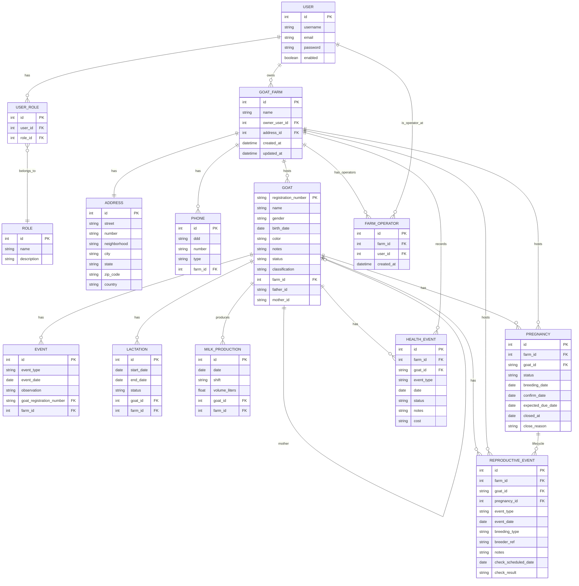

<div align="center">

# 🐐 CapriGestor – Backend

### Sistema completo para gestão de caprinos com arquitetura limpa, segura e escalável

[](https://www.java.com)
[](https://spring.io/projects/spring-boot)
[](https://www.postgresql.org)
[](https://www.docker.com)

[📚 Portal de Documentação](./docs/INDEX.md) • [📋 Arquitetura](./docs/01-architecture/ARCHITECTURE.md) • [💼 Domínio](./docs/00-overview/BUSINESS_DOMAIN.md) • [🖥️ Frontend](https://github.com/albertovilar/caprigestor-frontend) • [📊 Swagger](http://localhost:8080/swagger-ui/index.html)

</div>

---

## 📊 Status do Projeto

> **Em Desenvolvimento** – MVP previsto para **02/10/2025**

---

## 📑 Índice

- [Sobre](#sobre-o-projeto)
- [Funcionalidades](#funcionalidades-principais)
- [Tecnologias](#tecnologias-utilizadas)
- [Arquitetura](#arquitetura-e-módulos)
- [Diagrama do Domínio](#diagrama-do-domínio-mermaid)
- [Diagrama de Classes](#diagrama-de-classes-mermaid)
- [Pré-requisitos](#pré-requisitos)
- [Instalação](#instalação)
- [Configuração](#configuração)
- [Perfis de Execução](#perfis-de-execução)
- [Uso](#como-usar)
- [Banco de Dados](#banco-de-dados)
- [Segurança](#segurança)
- [API](#api--documentação)
- [Testes](#testes)
- [Docker](#docker)
- [Licença](#licença)
- [Contato](#contato)
- [Mensageria](#-mensageria-de-eventos-rabbitmq)

---

## 📖 Sobre o Projeto

**CapriGestor** é uma API REST robusta e moderna desenvolvida para o gerenciamento completo de fazendas de caprinos. Construída com **Spring Boot 3** e seguindo os princípios de **arquitetura hexagonal** (ports & adapters), oferece uma solução escalável, segura e de fácil manutenção.

### 🎯 Objetivo

Fornecer uma plataforma centralizada para criadores de caprinos gerenciarem todos os aspectos de suas fazendas, desde o cadastro de animais até o rastreamento genealógico completo e controle de eventos.

---

## ✨ Funcionalidades Principais

### 🏡 Gestão de Fazendas
- ✅ Cadastro completo de fazendas com endereços e telefones
- ✅ Controle de propriedade e ownership
- ✅ Listagem e busca paginadas
- ✅ Gerenciamento de estábulos e locais
- ✅ **Logo do Capril:** campo `logoUrl` válido (http/https) em cadastros e atualizações de fazenda para exibir identidade visual

### 📰 Blog e Artigos
- ✅ **Módulo de Artigos:** endpoints públicos (`/public/articles`) para listagem de notícias e dicas
- ✅ Gestão administrativa completa com `ROLE_ADMIN` (detalhes em `docs/02-modules/ARTICLE_BLOG_MODULE.md`)

### 🛡️ GoatFarm Atomic Registration
O sistema implementa um fluxo de registro estrito e atômico para garantir consistência e segurança:

- **Domain Rule:** `GoatFarm` é o Aggregate Root. A criação de Fazenda, Endereço, Telefones e Usuário (no caso anônimo) é indivisível.
- **Fluxo Atômico:** Uma única transação engloba todas as entidades. Se qualquer validação falhar, nada é persistido (Rollback total).
- **Security & Privacy:**
  - **Authenticated Flow:** Se o usuário já está logado, ele se torna automaticamente o *Owner*. Qualquer dado de usuário enviado no payload é ignorado para prevenir *Account Takeover*.
  - **Anonymous Flow:** Cria automaticamente um novo usuário com `ROLE_USER`.
    - Bloqueia envio de campos sensíveis (`roles`, `admin`, `id`).
    - Se o e-mail já existe, retorna erro genérico para impedir *User Enumeration*.
  - **Anti-Mass Assignment:** DTOs de entrada são blindados contra injeção de propriedades não autorizadas.

### 🐐 Gestão de Animais
- ✅ Cadastro detalhado de caprinos com todas as informações relevantes
- ✅ Rastreamento genealógico completo (pai, mãe, avós)
- ✅ Visualização de árvore genealógica interativa
- ✅ Status e categorização (PO, PA, PC)
- ✅ Busca avançada e filtros

### 🥛 Gestão de Produção Leiteira e Lactação
- ✅ **Lactação:** Ciclo de vida produtivo (abertura, secagem, status ativo/fechado)
- ✅ **Sumário de Lactação:** novos endpoints `/active/summary` e `/lactations/{id}/summary` para visão consolidada
- ✅ **Produção Diária:** Registro de ordenhas por turno (Manhã/Tarde)
- ✅ Controle de volume e observações
- ✅ Histórico completo de lactações e produções
- ✅ Validação de duplicidade e regras de negócio

### 🧬 Regras de Negócio (Genealogia & Classificação)

O sistema valida a genealogia com base na classificação do animal:

| Classificação | Descrição | Exigência de Filiação |
| :--- | :--- | :--- |
| **PO** | *Puro de Origem* | 🔴 **Obrigatório** (Pai e Mãe) |
| **PC** | *Puro por Cruza* | 🔴 **Obrigatório** (Pai e Mãe) |
| **PA** | *Puro por Avaliação* | 🟢 **Opcional** (Permite cadastro sem filiação) |

> **Nota:** Os genitores (pai/mãe) podem pertencer a **outra fazenda**, permitindo o registro de animais adquiridos de terceiros ou inseminação externa.

### 📅 Eventos e Rastreabilidade
- ✅ Registro de nascimentos, coberturas e partos
- ✅ Histórico de pesagens
- ✅ Histórico completo por animal
- ✅ Filtros avançados por tipo e período

### 🩺 Gestão de Saúde (Health Module)
- ✅ **Vacinas e Tratamentos:** Registro completo de eventos sanitários.
- ✅ **Agendamento:** Suporte a eventos agendados (futuros) e realizados.
- ✅ **Status:** Controle de fluxo (AGENDADO, REALIZADO, CANCELADO).
- ✅ **Endpoints:**
  - `POST /api/goatfarms/{farmId}/goats/{goatId}/health-events` (Agendar/Registrar)
  - `PUT /.../health-events/{eventId}` (Editar dados)
  - `PATCH /.../health-events/{eventId}/done` (Marcar como realizado)
  - `PATCH /.../health-events/{eventId}/cancel` (Cancelar evento)
  - `GET /.../health-events/{eventId}` (Detalhes)
  - `GET /.../health-events` (Listagem por animal com filtros de data/status)
  - *Planejado:* Endpoint de calendário geral da fazenda (`listCalendar`).

### 🔐 Controle de Acesso
- ✅ Autenticação JWT stateless
- ✅ Autorização baseada em roles (ADMIN, FARM_OWNER, OPERATOR)
- ✅ Proteção de endpoints sensíveis
- ✅ Integração OAuth2

**Permissões por perfil (resumo):**
- `ROLE_ADMIN`: Acesso total ao sistema.
- `ROLE_FARM_OWNER`: Acesso total aos recursos da **própria fazenda** (`farmId`).
- `ROLE_OPERATOR`: Acesso operacional restrito às fazendas onde possui vínculo explícito.
  - O vínculo é persistido na tabela `tb_farm_operator`.
  - A validação é feita via `OwnershipService.canManageFarm(farmId)`, garantindo que o operador só acesse fazendas permitidas.

**Endpoint de permissões da fazenda:**
- `GET /api/goatfarms/{farmId}/permissions` disponível para `ROLE_ADMIN`, `ROLE_OPERATOR` e `ROLE_FARM_OWNER`.

---

## 🛠️ Tecnologias Utilizadas

### Core
- **Java 21** – Linguagem de programação moderna e robusta
- **Spring Boot 3.x** – Framework principal para desenvolvimento
- **Spring Security** – Segurança e controle de acesso
- **Spring Data JPA** – Camada de persistência

### Banco de Dados
- **PostgreSQL 16** – Banco de dados relacional principal
- **Flyway** – Controle de versionamento do schema
- **Testcontainers** – Banco efêmero para testes de integração
- **H2 Database** – Apenas para testes unitários isolados (opcional)

### Segurança
- **JWT (JSON Web Tokens)** – Autenticação stateless
- **OAuth2** – Protocolo de autorização

### Documentação e Testes
- **Swagger/OpenAPI** – Documentação interativa da API
- **JUnit 5** – Framework de testes
- **Mockito** – Mocks para testes unitários
- **Testcontainers** – Infraestrutura de testes robusta

### DevOps
- **Docker** – Containerização
- **Docker Compose** – Orquestração de containers
- **Maven** – Gerenciamento de dependências e build

---

## 🏗️ Arquitetura e Módulos

O projeto segue a **arquitetura hexagonal** (ports & adapters), garantindo baixo acoplamento e alta coesão.

### 📦 Estrutura de Camadas

```
domain → application → infrastructure
```

### 🗂️ Módulos

| Módulo | Descrição |
|--------|-----------|
| **goat** | Regras de negócio e acesso a dados de caprinos |
| **reproduction** | Ciclo reprodutivo (coberturas, gestações, eventos reprodutivos) |
| **milk** | Gestão de produção de leite e lactações |
| **events** | Gestão de eventos (nascimentos, coberturas, pesagens, etc.) |
| **health** | Gestão sanitária e veterinária (vacinas, tratamentos) |
| **genealogy** | Relacionamento e linhagem (Projeção On-Demand) |
| **farm** | Entidades e serviços de fazendas/estábulos/locais |
| **address** | Gestão de endereços e localizações |
| **phone** | Gestão de contatos telefônicos |
| **article** | Blog e gerenciamento de conteúdo informativo |
| **authority** | Autenticação, autorização, usuários e papéis |
| **shared** | Utilitários, DTOs comuns, exceções e infra compartilhada |

### 🧠 Filosofia Arquitetural (Hexagonal)

- Princípios: inversão de dependências, isolamento do domínio e Portas & Adaptadores.
- Convenção pragmática de nomes mapeada para hexagonal:
  - Controller → Adaptador de Entrada (Driving Adapter)
  - UseCase / Port → Porta de Entrada (Input Port)
  - Business → Serviço de Aplicação (Implementa Input Port)
  - Output Port → Porta de Saída (Interface para Infraestrutura)
  - Adapter / Repository → Adaptador de Saída (Driven Adapter)

### ✅ Regra de Dependência (Hexagonal)

- `business` **nunca** importa `api.*`.
- Mapeamentos separados: `api.mapper` (DTO ↔ VO) e `business.mapper` (VO ↔ Entity).
- **Health** é a referência de implementação.
- Gate automático: `HexagonalArchitectureGuardTest` falha o build em qualquer regressão.

---

## 🧭 Diagrama do Domínio (Mermaid)



---

## 🧩 Diagrama de Classes (Mermaid)


---

## 📋 Pré-requisitos

Antes de começar, certifique-se de ter instalado:

- ☕ **Java 21** ou superior
- 🔧 **Maven 3.8+** (ou use o wrapper incluído)
- 🐳 **Docker & Docker Compose** (obrigatório para banco de dados e mensageria)
- 💻 **IDE**: IntelliJ IDEA, Eclipse ou VS Code

---

## 🚀 Instalação

1️⃣ **Clone o repositório**
```bash
git clone https://github.com/albertovilar/caprigestor-backend.git
cd caprigestor-backend
```

2️⃣ **Subir infraestrutura (PostgreSQL + RabbitMQ)**
```bash
cd docker
docker compose up -d
```

## 🧪 Testes

> **Nota sobre Warnings:** É comum ver avisos do "Mockito inline agent" (Byte Buddy) durante a execução dos testes em Java 21+. Isso não afeta o resultado. Para suprimir, use a flag `-XX:+EnableDynamicAgentLoading`.

O projeto possui uma suíte robusta de testes:

- **Testes Unitários:** Cobrem as regras de negócio (`*Business`), isolados de dependências externas (banco, web). Organizados espelhando a estrutura de pacotes de `src/main`.
- **Testes de Integração:** Validam o fluxo completo, incluindo banco de dados e endpoints REST (`@SpringBootTest`).
- **Arquitetura:** Testes que garantem a integridade da Arquitetura Hexagonal (dependências corretas entre camadas).

Para executar os testes:
```bash
./mvnw clean test
```

---

## 🐳 Docker

Para subir o ambiente completo (Banco de Dados + RabbitMQ):

```bash
cd docker
docker compose up -d
```
> **Serviços:**
> - PostgreSQL: `localhost:5432`
> - RabbitMQ UI: `http://localhost:15672` (admin/admin)
> - PgAdmin: `http://localhost:8081`

---

## ⚙️ Configuração

### Filosofia dos Perfis
O projeto adota uma estratégia estrita de perfis para evitar configurações implícitas e garantir consistência entre ambientes.

- **`default`**: Apenas configurações básicas (logging, jackson). **Não conecta ao banco.**
- **`dev`**: Ambiente de desenvolvimento. Conecta ao **PostgreSQL local** e roda **Flyway**.
- **`test`**: Ambiente de testes. Usa **Testcontainers** para subir um banco efêmero.
- **`prod`**: Ambiente de produção. Configurações via variáveis de ambiente.

---

## 💻 Perfis de Execução

O projeto está configurado para usar o perfil `dev` por padrão para facilitar o desenvolvimento.

| Perfil | Uso | Banco de Dados | Flyway | DDL Auto |
|--------|-----|----------------|--------|----------|
| `dev` | Desenvolvimento (Padrão) | PostgreSQL (Docker) | ✅ Habilitado | `validate` |
| `test` | Testes Automatizados | Testcontainers | ✅ Habilitado | `validate` |
| `prod` | Produção | PostgreSQL (AWS/Cloud) | ✅ Habilitado | `validate` |
| `default` | Base | ❌ Nenhum | ❌ Desabilitado | `none` |

### ▶️ Como Executar (Modo Dev)

**Via Maven Wrapper (Simples):**
O perfil `dev` é ativado automaticamente.
```bash
# Windows (PowerShell)
./mvnw.cmd spring-boot:run

# Linux/Mac
./mvnw spring-boot:run
```

**Via Maven (Explícito):**
Caso queira forçar um perfil específico:
```bash
./mvnw.cmd spring-boot:run -Dspring-boot.run.profiles=dev
```

**Via JAR:**
```bash
java -jar target/CapriGestor-0.0.1-SNAPSHOT.jar --spring.profiles.active=dev
```

---

## 💻 Como Usar

Após iniciar com o perfil `dev`, a API estará disponível em:

- **API Base:** `http://localhost:8080/api`
- **Swagger UI:** `http://localhost:8080/swagger-ui/index.html`

> ⚠️ **Importante:** A maioria das operações requer autenticação via Bearer Token e os dados são isolados por `farmId`.

---

## 🗄️ Banco de Dados

### Versionamento (Flyway)
Todo o schema do banco é gerenciado pelo **Flyway**.
- Migrations em: `src/main/resources/db/migration`
- O Hibernate **apenas valida** o schema (`ddl-auto=validate`), nunca o altera.

### H2 Database
O H2 é utilizado em dois cenários:
1.  **Testes Unitários**: Execução rápida e isolada.
2.  **Smoke Tests**: Validação rápida do build (`profile: smoke`), permitindo rodar a aplicação em memória sem depender do Docker.

### Flyway V16 – banco sujo com ACTIVE duplicada

A migration `V16` cria um índice único para garantir apenas **uma gestação ativa por cabra**. Em bancos de dados "sujos" (com duplicatas existentes), essa migration falhará.

O fluxo recomendado é totalmente manual e está documentado em:
- `src/main/resources/db/manual/datafix_duplicate_active_pregnancy.sql`  
  (contém **diagnóstico**, **fix seguro** e **verificação final**)

**Procedimento de Correção (ambiente dev com PostgreSQL Docker):**

1.  **Rodar diagnóstico (verificar se há duplicidades):**

    ```sql
    SELECT farm_id, goat_id, COUNT(*) AS active_count
    FROM pregnancy
    WHERE status = 'ACTIVE'
    GROUP BY farm_id, goat_id
    HAVING COUNT(*) > 1;
    ```

    - Se o resultado vier vazio, não há problema para a V16.
    - Se houver linhas, existem gestações `ACTIVE` duplicadas que precisam ser corrigidas.

    Exemplo usando o container padrão do projeto:

    ```bash
    docker exec -it caprigestor-postgres \
      psql -U admin -d caprigestor_test \
      -c "SELECT farm_id, goat_id, COUNT(*) AS active_count FROM pregnancy WHERE status = 'ACTIVE' GROUP BY farm_id, goat_id HAVING COUNT(*) > 1;"
    ```

2.  **Executar Data Fix (fechar gestações duplicadas mais antigas):**

    - Execute o script manual em `src/main/resources/db/manual/datafix_duplicate_active_pregnancy.sql`
      diretamente no banco (via `psql`, PgAdmin ou outra ferramenta SQL).
    - O script mantém apenas a gestação `ACTIVE` mais recente por `(farm_id, goat_id)` e fecha as demais.

3.  **Rodar verificação final:**

    - Reexecute o SELECT de diagnóstico (ou o bloco **C) Verificação final** do script manual).
    - O resultado deve estar vazio antes de subir a aplicação.

4.  **Subir aplicação normalmente:**

    - Com o banco já corrigido, a aplicação subirá e o Flyway aplicará a `V16` com sucesso.

---

## 🔐 Segurança

- **OAuth2 + JWT:** Autenticação stateless robusta.
- **Roles:**
  - `ROLE_ADMIN`: Acesso total.
  - `ROLE_OPERATOR`: Acesso operacional à fazenda vinculada.
- **Header Obrigatório:**
  ```http
  Authorization: Bearer <seu-token-jwt>
  ```

---

## 🧪 Testes

Os testes de integração sobem a aplicação completa usando **Testcontainers** para garantir fidelidade ao ambiente real.

**Executar todos os testes:**
```bash
# Windows
./mvnw.cmd test

# Linux/Mac
./mvnw test
```
> *Nota: É necessário ter o Docker rodando para que os Testcontainers funcionem.*

---

## 🐳 Docker

Para subir todo o ecossistema (App + Banco + Mensageria):

```bash
cd docker
docker compose up -d
```

| Serviço | Porta | Descrição |
|---------|-------|-----------|
| API | 8080 | Backend Spring Boot |
| PostgreSQL | 5432 | Banco de Dados |
| RabbitMQ | 5672 | Mensageria (AMQP) |
| RabbitMQ UI | 15672 | Painel de Gestão |
| PgAdmin | 8081 | Gestão Visual do Banco |

---

## 📨 Mensageria de Eventos (RabbitMQ)

O sistema utiliza RabbitMQ para processamento assíncrono de eventos (nascimentos, atualizações), garantindo desacoplamento.

- **Exchange:** `events-exchange`
- **Fila:** `events-queue`
- **Routing Key:** `event.created`

Para monitorar, acesse o painel do RabbitMQ em `http://localhost:15672` (User/Pass: `admin`/`admin`).

---

## 📄 Licença

Este projeto é proprietário. Todos os direitos reservados.

---

## 👤 Contato

**José Alberto Vilar Pereira**

📧 Email: albertovilar1@gmail.com
💼 LinkedIn: [Alberto Vilar](https://www.linkedin.com/in/alberto-vilar-316725ab)
🐙 GitHub: [@albertovilar](https://github.com/albertovilar)

<div align="center">
Desenvolvido com ☕ e ❤️ por Alberto Vilar

⭐ Se este projeto foi útil para você, considere dar uma estrela!
</div>
