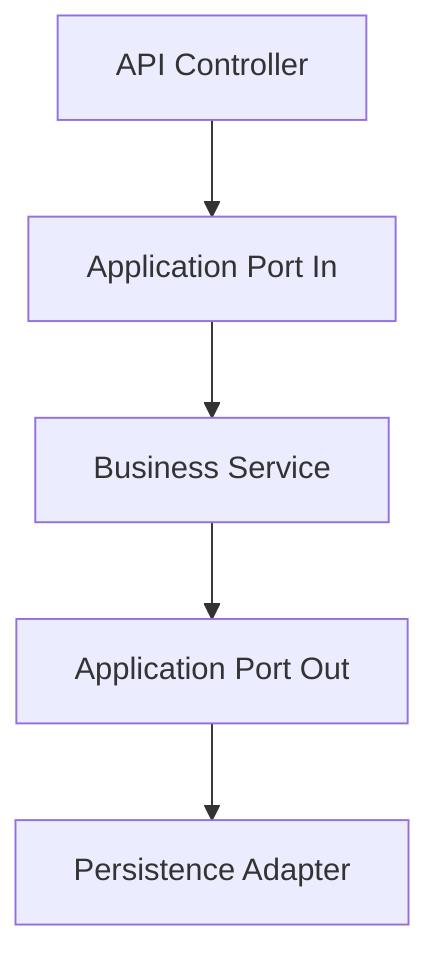

# Arquitetura do Sistema GoatFarm
Ultima atualizacao: 2026-02-10
Escopo: visao tecnica, modularizacao por dominio, shared kernel e gates de arquitetura.
Links relacionados: [Portal](../INDEX.md), [ADR](./ADR), [API_CONTRACTS](../03-api/API_CONTRACTS.md), [Modulos](../02-modules), [Dominio](../00-overview/BUSINESS_DOMAIN.md)

## Visao geral
O backend segue arquitetura hexagonal (Ports and Adapters) com separacao explicita entre API, casos de uso, regras de negocio e persistencia.

A estrutura prioriza isolamento de dominio, testabilidade e substituicao de adaptadores sem impacto no core.

## Regras / Contratos
- Camadas por modulo:
  - `api/controller`, `api/dto`, `api/mapper`
  - `application/ports/in`, `application/ports/out`
  - `business/*service`, `business/bo`
  - `persistence/adapter`, `persistence/entity`, `persistence/repository`, `persistence/projection`
- Contrato farm-level: controllers de fazenda usam validacao de ownership (`@ownershipService.canManageFarm` ou regra equivalente).
- Shared kernel entre `milk` e `reproduction`:
  - Contrato: `com.devmaster.goatfarm.sharedkernel.pregnancy.PregnancySnapshot`
  - Consulta no modulo `milk` via `PregnancySnapshotQueryPort`.
- Fronteira de contexto:
  - `milk` nao importa classes internas de `reproduction` em `api`, `business` e `persistence.entity`.

## Fluxos principais
1. Fluxo HTTP farm-level:
   `Controller -> Port In -> Business -> Port Out -> Adapter -> Banco`.
2. Fluxo de leitura de prenhez no modulo de leite:
   `milk.business -> PregnancySnapshotQueryPort -> adapter SQL -> snapshot`.
3. Fluxo de erro:
   excecoes de dominio sobem para handlers globais e seguem padrao do [API_CONTRACTS](../03-api/API_CONTRACTS.md).

## Gates
| Gate | Objetivo | Evidencia |
|---|---|---|
| `HexagonalArchitectureGuardTest` | Impedir import indevido de `business` para `api` | [src/test/java/com/devmaster/goatfarm/architecture/HexagonalArchitectureGuardTest.java](../../src/test/java/com/devmaster/goatfarm/architecture/HexagonalArchitectureGuardTest.java) |
| `MilkReproductionBoundaryArchUnitTest` | Garantir fronteira entre `milk` e `reproduction` | [src/test/java/com/devmaster/goatfarm/architecture/MilkReproductionBoundaryArchUnitTest.java](../../src/test/java/com/devmaster/goatfarm/architecture/MilkReproductionBoundaryArchUnitTest.java) |

## Referencias internas
- Modulos mapeados: `address`, `article`, `authority`, `events`, `farm`, `genealogy`, `goat`, `health`, `milk`, `phone`, `reproduction`.
- Convencao de API: [API_CONTRACTS](../03-api/API_CONTRACTS.md).
- Decisoes arquiteturais historicas: [ADR](./ADR).
