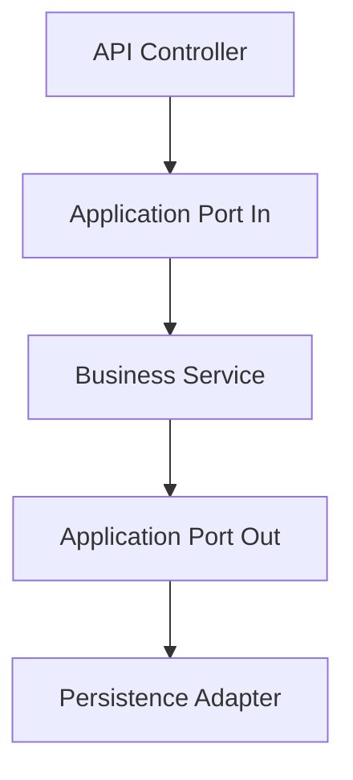

# Arquitetura do Sistema GoatFarm
Ultima atualizacao: 2026-09-08
Escopo: visao tecnica, modularizacao por dominio, shared kernel e gates de arquitetura.
Links relacionados: [Portal](../INDEX.md), [ADR](./ADR), [API_CONTRACTS](../03-api/API_CONTRACTS.md), [Modulos](../02-modules), [Dominio](../00-overview/BUSINESS_DOMAIN.md)

## Visao geral
O backend segue arquitetura hexagonal (Ports and Adapters) com separacao explicita entre API, casos de uso, regras de negocio e persistencia.

```mermaid
graph TD
    Controller[API Controller] --> InPort[Application Port In]
    InPort --> Business[Business Service]
    Business --> OutPort[Application Port Out]
    OutPort --> Adapter[Persistence Adapter]
```

A estrutura prioriza isolamento de dominio, testabilidade e substituicao de adaptadores sem impacto no core.

## Regras / Contratos
- Camadas por modulo:
  - `api/controller`, `api/dto`, `api/mapper`
  - `application/ports/in`, `application/ports/out`
  - `business/*service`, `business/bo`
  - `persistence/adapter`, `persistence/entity`, `persistence/repository`, `persistence/projection`
- Contrato farm-level: controllers de fazenda usam validacao de ownership (`@ownershipService.canManageFarm` ou regra equivalente).
- A intenção da autorização é declarada por annotations semânticas em
  `config.security.authorization`: `@CanManageFarm`, `@FarmOwnerOnly`,
  `@AdminOnly`, `@PublicEndpoint` e `@AuthenticatedFarmRead`. Elas são apenas
  meta-dados de entrada; `@CanManageFarm` e `@FarmOwnerOnly` continuam delegando
  a decisão ao `OwnershipService` existente.
- `AuthorizationPolicyGuardTest` percorre os controllers farm-scoped em
  reflexão e impede endpoint novo sem política explícita. Também verifica a
  presença do parâmetro `farmId` nas policies que usam esse identificador.
- As exceções não são escondidas: permissões de fazenda continuam com sua
  expressão explícita de papéis e consultas públicas são marcadas no método.
- Shared kernel entre `milk` e `reproduction`:
  - Contrato: `com.devmaster.goatfarm.sharedkernel.pregnancy.PregnancySnapshot`
  - Consulta no modulo `milk` via `PregnancySnapshotQueryPort`.
- Fronteira de contexto:
  - `milk` nao importa classes internas de `reproduction` em `api`, `business` e `persistence.entity`.
- Fronteiras críticas reforçadas na W4:
  - `OwnershipService` consulta o responsável da fazenda por `FarmOwnerQueryPort` e recebe um `AuthenticatedPrincipal`, sem importar repositórios Spring Data.
  - `GoatGenderValidator` consulta apenas `GoatValidationQueryPort.GoatValidationSnapshot`; entidades JPA não atravessam o contrato de validação.
  - `EventPublisher` recebe `EventPublication`, um contrato de aplicação imutável, e não a entidade `events.persistence.entity.Event`.
  - `JwtService` emite tokens a partir de `AuthenticatedPrincipal`; o mapeamento de usuário persistente fica restrito ao caso de uso de autenticação.
  - RabbitMQ é opcional e fail-closed: somente é criado quando `caprigestor.messaging.enabled=true`; sem a propriedade, o publisher NoOp é usado.
  - A fronteira do Goat é protegida por `GoatPersistenceBoundaryArchUnitTest`:
    camadas de aplicação, negócio, API, domínio e configuração não dependem de
    entidades/repositórios/projeções JPA do Goat. A resolução de referências
    fica em `GoatReferenceResolver`, mantendo tokens técnicos explícitos e RG
    como lookup registral.

Essas regras não afirmam que todo o domínio já esteja livre de JPA. Módulos
legados ainda manipulam entidades em alguns casos de uso; a W4 isolou os
contratos que participam diretamente de autorização, emissão de credenciais,
validação crítica e publicação de eventos.

## Fluxos principais
1. Fluxo HTTP farm-level:
   `Controller -> Port In -> Business -> Port Out -> Adapter -> Banco`.
2. Fluxo de leitura de prenhez no modulo de leite:
   `milk.business -> PregnancySnapshotQueryPort -> adapter SQL -> snapshot`.
3. Fluxo de erro:
   excecoes de dominio sobem para handlers globais e seguem padrao do [API_CONTRACTS](../03-api/API_CONTRACTS.md).
4. Fluxo de sessão:
   `AuthBusiness -> RefreshSessionPersistencePort -> RefreshSessionPersistenceAdapter -> refresh_session`. O adapter persiste somente hashes de refresh token e faz a transição condicional de sessão ativa para consumida.

## Gates
| Gate | Objetivo | Evidencia |
|---|---|---|
| `HexagonalArchitectureGuardTest` | Impedir import indevido de `business` para `api` | [src/test/java/com/devmaster/goatfarm/architecture/HexagonalArchitectureGuardTest.java](../../src/test/java/com/devmaster/goatfarm/architecture/HexagonalArchitectureGuardTest.java) |
| `MilkReproductionBoundaryArchUnitTest` | Garantir fronteira entre `milk` e `reproduction` | [src/test/java/com/devmaster/goatfarm/architecture/MilkReproductionBoundaryArchUnitTest.java](../../src/test/java/com/devmaster/goatfarm/architecture/MilkReproductionBoundaryArchUnitTest.java) |
| `OwnershipSecurityBoundaryArchUnitTest` | Impedir dependências de entidades JPA nos contratos críticos de segurança, validação e eventos | [src/test/java/com/devmaster/goatfarm/architecture/OwnershipSecurityBoundaryArchUnitTest.java](../../src/test/java/com/devmaster/goatfarm/architecture/OwnershipSecurityBoundaryArchUnitTest.java) |
| `GoatPersistenceBoundaryArchUnitTest` | Impedir o retorno da costura legada e o vazamento de tipos de persistência do Goat para o core | [src/test/java/com/devmaster/goatfarm/architecture/GoatPersistenceBoundaryArchUnitTest.java](../../src/test/java/com/devmaster/goatfarm/architecture/GoatPersistenceBoundaryArchUnitTest.java) |

## Referencias internas
- Modulos mapeados: `address`, `article`, `authority`, `events`, `farm`, `genealogy`, `goat`, `health`, `milk`, `phone`, `reproduction`.
- Convencao de API: [API_CONTRACTS](../03-api/API_CONTRACTS.md).
- Decisoes arquiteturais historicas: [ADR](./ADR).
