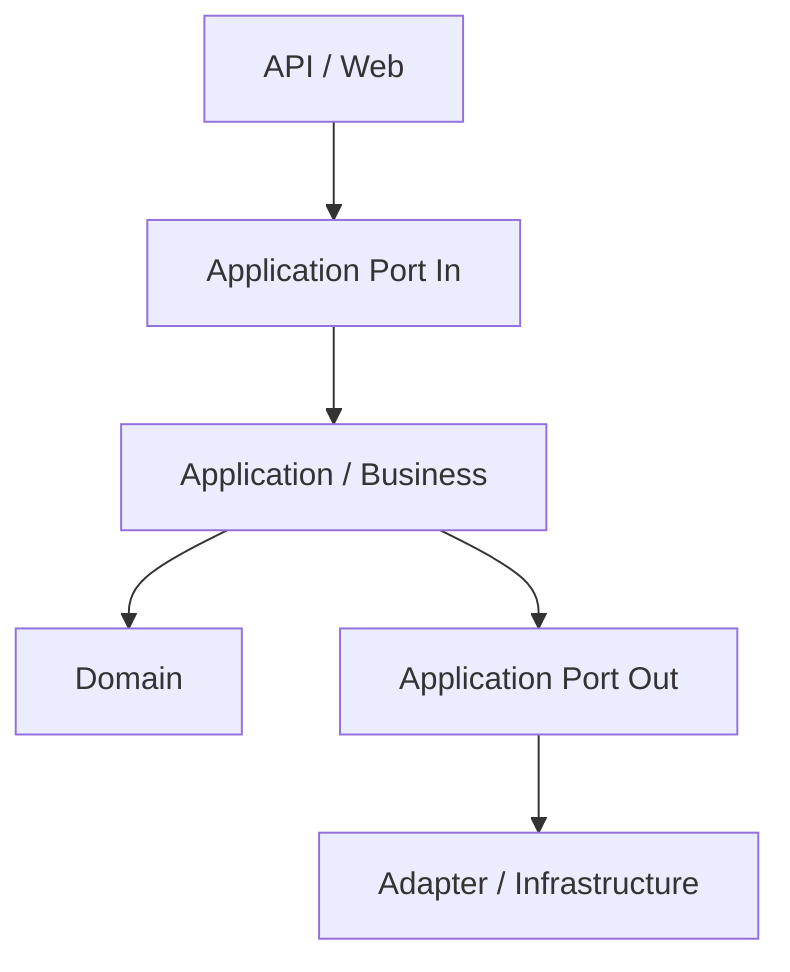

# Arquitetura do Sistema CapriGestor

Última atualização: 2026-09-13
Escopo: referência arquitetural, modularização por domínio, shared kernel e gates.

Links: [Portal](../INDEX.md), [ADRs](./ADR),
[Contratos API](../03-api/API_CONTRACTS.md), [Módulos](../02-modules),
[Domínio](../00-overview/BUSINESS_DOMAIN.md),
[Status](../00-overview/PROJECT_STATUS.md).

## Visão geral

O backend é um monólito modular Java/Spring Boot que segue arquitetura
hexagonal (Ports and Adapters) de forma pragmática. A direção conceitual é:

```mermaid
graph TD
    Controller[API / Web] --> InPort[Application Port In]
    InPort --> Business[Application / Business]
    Business --> Domain[Domain]
    Business --> OutPort[Application Port Out]
    OutPort --> Adapter[Adapter / Infrastructure]
```

## Target architecture

O target permanente é um core de negócio isolado de Web/HTTP, JPA/persistência,
segurança técnica e infraestrutura concreta. API mapeia transporte e chama
casos de uso; application orquestra e expõe ports; adapters implementam ports e
retêm detalhes de banco, integração e framework. Domain não conhece controllers,
DTOs HTTP, JPA/Hibernate, Spring Security ou adapters.

DDD, SOLID e Clean Code orientam os limites. Uma abstração é criada apenas se
proteger um boundary ou trouxer ganho demonstrável de manutenção; uso de
`@Service` e transações apropriadas não é, isoladamente, violação.

## Regras e contratos atuais

- Convenção por módulo: `api/controller`, `api/dto`, `api/mapper`,
  `application/ports/in`, `application/ports/out`, `business`, `domain` quando
  aplicável e `persistence/adapter`, `persistence/entity`,
  `persistence/repository`, `persistence/projection`.
- Controllers não acessam repositories, entities ou adapters de persistência
  diretamente; chamam ports/casos de uso e mapeiam DTOs.
- Toda operação farm-scoped preserva `farmId`. A intenção é declarada por
  `@CanManageFarm`, `@FarmOwnerOnly`, `@AdminOnly`, `@AuthenticatedFarmRead` ou
  `@PublicEndpoint` e a decisão usa o boundary `FarmAuthorizationUseCase`.
- `CurrentPrincipalQueryUseCase` entrega o principal ao core.
  `SpringSecurityCurrentPrincipalAdapter` é o único adapter que lê
  `SecurityContextHolder`; JWT não é fonte de autorização viva.
- A API HTTP não expõe operações globais de limpeza/recriação de banco. Reset de
  DEV é uma operação de tooling explicitamente invocada; bootstrap administrativo
  usa configuração externa e permanece separado de destruição de dados.
- `AuthorizationPolicyGuardTest` percorre controllers farm-scoped e impede rota
  nova sem política explícita. Também verifica `farmId` quando a policy o usa.
- O shared kernel de gravidez entre `milk` e `reproduction` usa
  `PregnancySnapshot` e `PregnancySnapshotQueryPort`; `milk` não importa
  internos de `reproduction` em API, business ou entity.

## Boundaries implementados

### Segurança e ownership

`OwnershipService` implementa `FarmAuthorizationUseCase` e consulta
`CurrentPrincipalQueryUseCase`, `FarmAccessQueryPort` e `FarmOwnerQueryPort`.
Serviços de negócio não injetam `OwnershipService` concreto nem entidades `User`
para decisões de acesso. `JwtService` recebe `AuthenticatedPrincipal`, mantendo
o mapeamento persistente no caso de uso de autenticação.

No Authority, hashing de senha é uma saída da aplicação (`PasswordHashingPort`).
`PasswordHashingAdapter`, em `config.security`, delega ao `PasswordEncoder`
configurado sem expor Spring Security ao business/application.

Na mesma fronteira, `AuthBusiness` usa `CredentialAuthenticationPort` para
autenticar credenciais e `AuthTokenPort` para emitir e ler metadados de tokens.
`SpringCredentialAuthenticationAdapter` encapsula `AuthenticationManager` e
`Authentication`; `JwtTokenAdapter` encapsula `JwtService`, `JwtDecoder` e o
tipo `Jwt`. O caso de uso não depende dessas APIs Spring/JWT e mantém a política
existente de login, refresh, rotação, replay, logout e claims.

`AuthorityAccount`, `AuthorityRole`, `RefreshSessionRecord` e
`PasswordResetTokenRecord` são os modelos de aplicação usados pelo core de
acesso. `AuthorityPersistenceMapper` e os adapters traduzem esses modelos para
as entidades JPA `User`, `Role`, `RefreshSession` e `PasswordResetToken`.

O cadastro atômico de fazenda mantém a associação JPA histórica com `User`, mas
a boundary DEV-A11-I3-C agora a resolve somente no adapter de persistência.
`GoatFarmBusiness` usa `UserManagementUseCase`/`AuthorityAccount`, sem importar
entidade JPA ou port específico de User.

Farm, Address e Phone usam modelos e commands tecnológicos neutros nos ports e
no core; os adapters montam a graph JPA e preservam a transação externa do caso
de uso de fazenda. Endpoints diretos de Address/Phone e as políticas de ownership
permanecem compatíveis.

### Goat e eventos

`GoatGenderValidator` usa `GoatValidationQueryPort.GoatValidationSnapshot`, e
`EventPublisher` recebe `EventPublication`, sem transportar entidades JPA. A
fronteira Goat é protegida por `GoatPersistenceBoundaryArchUnitTest`: application,
business, API, domain e configuração não dependem de tipos JPA do módulo Goat.
`GoatReferenceResolver` centraliza tokens técnicos e RG como lookup registral.

`GoatPage` e `GoatPageQuery` pertencem a `goat.application.pagination` e não
dependem de Spring Data. O controller converte o transporte HTTP e o adapter
converte para `Pageable`/`Page` somente na borda de persistência.

### Paginação compartilhada (Article e Farm)

`application.pagination` fornece `PageQuery`, `SortSpec`/`SortDirection` e
`PageResult` como contratos neutros do core. Article e Farm recebem esses tipos
nos ports e casos de uso; a API ainda recebe `Pageable` e reconstrói o `Page`
Spring na borda para preservar os JSONs existentes. Os adapters convertem a
consulta neutra para `PageRequest`/`Sort` e mapeiam entidades JPA para records/VOs.
Todas as ordens de sort recebidas são preservadas na ordem original. Destaques
de Article usam a intenção `findLatestPublished(limit)`, sem paginação Spring no
business.

### Paginação de Health

Health segue o mesmo boundary neutro: `HealthEventQueryUseCase` e
`HealthEventPersistencePort` usam `PageQuery`/`PageResult`, enquanto controllers
continuam recebendo `Pageable` e reconstruindo o `Page` Spring via
`SpringPageMapper`. `FarmHealthAlertsBusiness` não usa paginação HTTP para seus
alertas; a operação de saída `findNextScheduledEvents(..., limit)` retorna uma
`HealthEventWindow` com até cinco eventos e o total de correspondências. O
adapter aplica internamente `scheduledDate ASC`, `page=0` e o limite solicitado.

### Lactação e leite

`milk.domain.Lactation` é agregado sem framework responsável por transições
`ACTIVE`/`DRY`. `LactationEntity` e mapper confinam JPA ao adapter.
`MilkProduction` e `FarmMilkProduction` possuem modelos de domínio próprios;
nomes JPA são preservados apenas onde a persistência precisa de compatibilidade.
Consultas farm-wide de gravidez passam por `PregnancyDryOffQueryUseCase`, sem SQL
do módulo Milk sobre tabelas de reprodução.

## Dívida arquitetural conhecida

O core application/business está livre de dependências diretas em entidades
JPA: o baseline de `ApplicationPortPersistenceBoundaryArchUnitTest` é zero e
o guard global impede regressões. Ainda existem dívidas independentes de
 persistência (por exemplo, `Page`/`Pageable`/`Sort`) que permanecem em
 Health, Inventory, Milk e Reproduction e serão tratadas em waves posteriores,
 sem reabrir o isolamento JPA concluído. Article e Farm já não importam esses
 tipos Spring no application/business.

A wave DEV-A11-I3-A isolou Article, a DEV-A11-I3-B isolou Health, e a
DEV-A11-I3-C isolou Farm/Address/Phone das entidades JPA (baseline 11 -> 5) e
DEV-A11-I3-D isolou Audit (baseline 5 -> 4), DEV-A11-I3-E1 isolou Commercial
(baseline 4 -> 1) e DEV-A11-I3-E2 isolou Finance (baseline 1 -> 0).
Address e Phone foram agrupados com Farm para uma boundary única de persistência
do agregado, pois seus ciclos de vida ainda são montados por `GoatFarm`.

A boundary DEV-A11-I3-E1 isolou Commercial com três ports de persistência
tecnologicamente neutros (`CustomerPersistencePort`, `AnimalSalePersistencePort`
e `MilkSalePersistencePort`). `CommercialBusiness` mantém a orquestração
transacional e os adapters resolvem Farm/Customer JPA na borda; contratos HTTP,
semântica de pagamento, snapshots de RG/nome e integração com `GoatManagementUseCase`
permanecem inalterados. A DEV-A11-I3-E2 aplica o mesmo limite ao Finance com
`OperationalExpenseCommand`/`OperationalExpenseRecord`; `OperationalFinanceBusiness`
usa apenas contratos de aplicação, enquanto o adapter resolve Farm e
`OperationalExpense` JPA. A baseline global de entidades JPA no core
application/business agora é zero.

A boundary DEV-A11-I2 de Authority/Security está concluída. O core Authority
tem zero dependências de infraestrutura concreta de Spring Security e zero
dependências de entidades JPA de Authority; os contratos de conta, papel,
refresh e recuperação usam modelos da aplicação. A antiga I2-D/I2-E não deve
ser recriada como waves independentes. Commercial usa modelos tecnológicos
neutros e Finance usa `farmId` com `GoatFarmPersistencePort` somente para
validar existência; ambos mantêm entidades JPA apenas nos adapters. Audit usa
`OperationalAuditRecord` como snapshot
tecnológico neutro; o adapter mapeia esse record para `OperationalAuditEntry` e
resolve a referência JPA de `GoatFarm`, mantendo entidades fora do core e o
fallback histórico por RG. A atomicidade concorrente do consumo de token de
recuperação é hardening de segurança separado.

Também persistem usos legados de JPA entities, `Page`/`Pageable`/`Sort` e APIs
de autenticação em módulos específicos. Após F2, a dívida de paginação permanece
em Inventory, Milk e Reproduction. Guards globais de zero tolerância para
essas categorias permanecem planejados até a remoção incremental. O estado da
wave está no [PROJECT_STATUS](../00-overview/PROJECT_STATUS.md); gates ativos e
planejados estão em [QUALITY_GATES](./QUALITY_GATES.md).

## Goat identity

`GoatId` técnico (`cabras.id`) já foi introduzido estruturalmente nas migrations
V39–V43. RG (`num_registro`) continua identificador de negócio/ABCC e snapshot
histórico. FKs locais críticas usam GoatId, enquanto RG pode coexistir como
lookup e compatibilidade de contrato.

O antigo plano estrutural **ID4-B0/ID4** é obsoleto e já foi implementado. Não
há wave futura para criar GoatId, promover `cabras.id` ou repetir V39–V43. Apenas
resíduos comprovados de **Goat Identity Transition Closure** (compatibilidade,
aliases, identidade de API, frontend e limpeza documental) podem ser planejados.

Correções de TOD/TOE/RG não reutilizam o `PUT` genérico. O caso administrativo
de retificação preserva o GoatId, não reescreve snapshots e grava
`goat_registration_history`; requer `ADMIN` ou `FARM_OWNER`. Trabalho pendente
de tokens, aliases, rotas e frontend é **Goat Identity Transition Closure**, não
uma nova implementação de GoatId.

## Fluxos principais

1. Farm-scoped HTTP: `Controller -> Port In -> Business -> Port Out -> Adapter -> Banco`.
2. Leitura de prenhez em Milk: `milk.business -> PregnancySnapshotQueryPort -> adapter SQL -> snapshot`.
3. Erro: exceções de domínio sobem para handlers globais conforme
   [API_CONTRACTS](../03-api/API_CONTRACTS.md).
4. Sessão: `AuthBusiness -> RefreshSessionPersistencePort ->
   RefreshSessionPersistenceAdapter -> refresh_session`; o adapter armazena
   hash de refresh token e faz a transição condicional da sessão.

## Gates arquiteturais ativos

| Gate | Objetivo |
|---|---|
| `HexagonalArchitectureGuardTest` | Impede import indevido de `business` para `api`. |
| `GlobalHexagonalBoundaryArchUnitTest` | Protege domain, controllers, confinamento de `SecurityContextHolder` e ausência de `JpaRepository` no core. |
| `ApplicationPortPersistenceBoundaryArchUnitTest` | Mantém exato e visível o baseline legado atual de 4 ports para entities. |
| `FarmAddressPhoneCoreBoundaryArchUnitTest` | Impede entidades JPA nos cores application/business de Farm, Address e Phone. |
| `AuditCoreBoundaryArchUnitTest` | Impede entidades JPA nos cores application/business de Audit. |
| `HealthBoundaryArchUnitTest` | Impede dependências de entidades JPA no core application/business de Health. |
| `OwnershipSecurityBoundaryArchUnitTest` | Protege ports críticos de segurança, ownership, validação e eventos. |
| `AuthorityPasswordBoundaryArchUnitTest` | Impede `PasswordEncoder` no core Authority. |
| `AuthorityAuthenticationBoundaryArchUnitTest` | Impede APIs concretas de autenticação/JWT no core Authority. |
| `GoatPersistenceBoundaryArchUnitTest` | Impede retorno de tipos JPA do Goat ao core. |
| `GoatHexagonalCoreArchUnitTest` | Protege paginação e boundary de aplicação do Goat. |
| `MilkReproductionBoundaryArchUnitTest` | Garante fronteira entre Milk e Reproduction. |
| `LactationDomainBoundaryArchUnitTest` | Impede vazamento de JPA/Spring/API no agregado de lactação. |

## Referências internas

- Módulos: `address`, `article`, `audit`, `authority`, `commercial`, `events`,
  `farm`, `genealogy`, `goat`, `health`, `inventory`, `milk`, `phone` e
  `reproduction`.
- Convenção de API: [API_CONTRACTS](../03-api/API_CONTRACTS.md).
- Decisões históricas: [ADRs](./ADR). ADRs e planos preservam seu contexto e
  não substituem código, migrations, testes ou este documento ativo.
