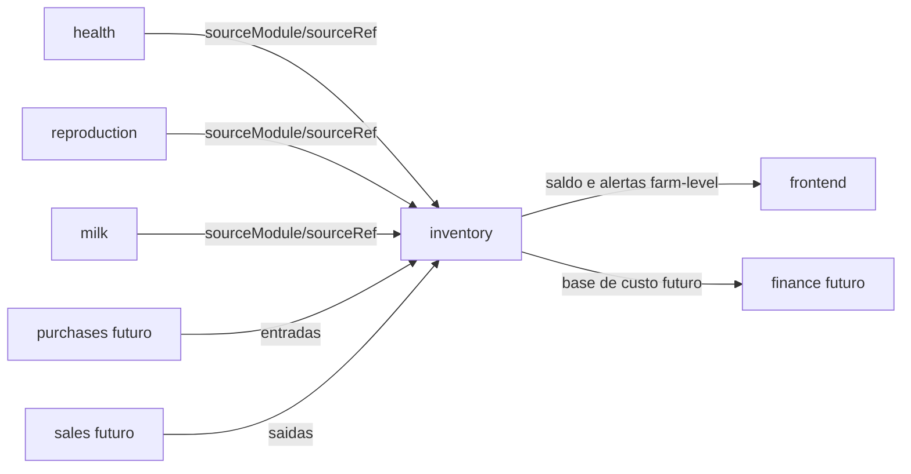
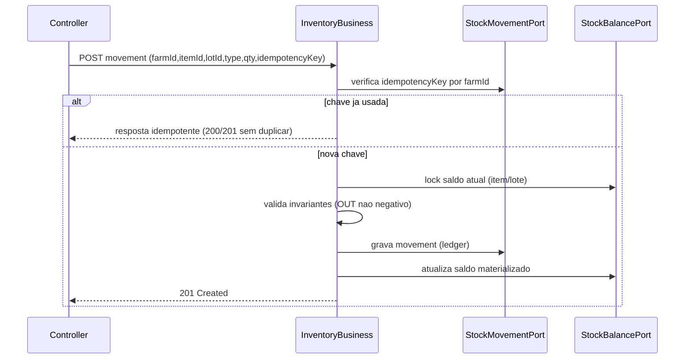
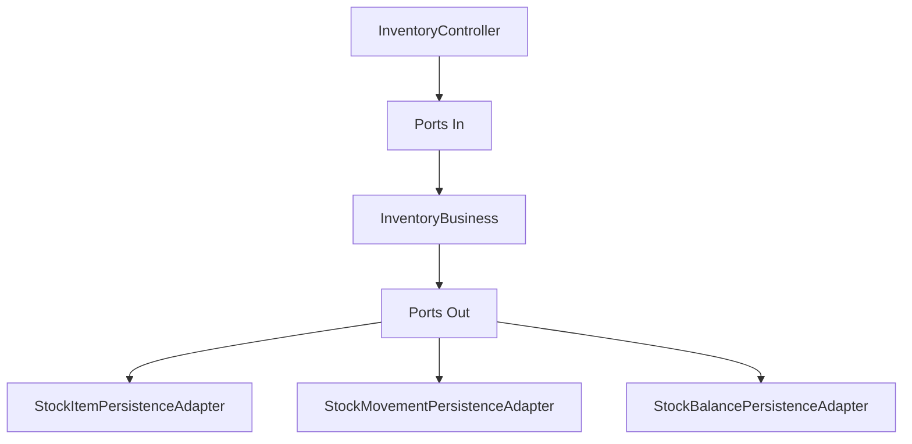

# Modulo Inventory (Estoque)
Ultima atualizacao: 2026-02-10
Escopo: especificacao do MVP de estoque farm-level com itens, lotes/validade, ledger de movimentos, saldo materializado e alertas.
Links relacionados: [Portal](../INDEX.md), [Arquitetura](../01-architecture/ARCHITECTURE.md), [API_CONTRACTS](../03-api/API_CONTRACTS.md), [Modulo Health](./HEALTH_VETERINARY_MODULE.md), [Modulo Lactacao](./LACTATION_MODULE.md), [Modulo Reproduction](./REPRODUCTION_MODULE.md), [ADR Inventory](../01-architecture/ADR/ADR-002-inventory-ledger-balance-and-lots.md), [TODO MVP](../_work/INVENTORY_TODO_MVP.md)

## Visao geral
O modulo `inventory` sera o contexto de referencia para controle de estoque por fazenda, com rastreabilidade completa de entradas, saidas e ajustes.

Objetivos do MVP:
- controlar itens de estoque por fazenda;
- suportar itens rastreaveis com lote e validade;
- manter historico auditavel (ledger) e leitura performatica de saldo;
- fornecer alertas farm-level para baixo estoque e lote proximo do vencimento;
- habilitar integracoes com `health`, `milk` e `reproduction` por referencia, sem acoplamento de entidades.

## Dominio
### Bounded context
- Contexto: `inventory`.
- Escopo: estritamente farm-level (`farmId` obrigatorio em todas as operacoes).
- Fronteiras:
- nao importa entidades internas de `health`, `milk`, `reproduction`, `finance`, `purchases` ou `sales`;
- integra por referencias `sourceModule` + `sourceRef`.

### Agregados e entidades
#### StockItem (agregado raiz)
- Campos principais:
- `id`
- `farmId`
- `name`
- `category` (`MEDICAMENTO`, `VACINA`, `HORMONIO`, `RACAO`, `INSUMO`, `OUTRO`)
- `unit` (`ML`, `DOSE`, `KG`, `L`, `UN`)
- `minQuantity`
- `active`
- `trackLot` (boolean)
- Responsabilidades:
- definir metadados do item;
- definir politica de rastreabilidade por lote;
- governar limite minimo para alerta.

#### StockLot (entidade do agregado StockItem)
- Campos principais:
- `id`
- `farmId`
- `itemId`
- `lotCode`
- `expiresAt`
- `initialQuantity`
- `active`
- Responsabilidades:
- identificar lote fisico;
- habilitar controle de validade;
- suportar baixa por lote (FEFO/selecionado).

#### StockMovement (ledger)
- Campos principais:
- `id`
- `farmId`
- `itemId`
- `lotId` (opcional para item sem lote)
- `movementType` (`IN`, `OUT`, `ADJUST`)
- `quantity`
- `occurredAt`
- `reason`
- `sourceModule` (`HEALTH`, `REPRODUCTION`, `MILK`, `PURCHASES`, `SALES`, `MANUAL`)
- `sourceRef` (string)
- `idempotencyKey`
- `unitCost` (opcional MVP, recomendado desde inicio para evolucao financeira)
- Responsabilidades:
- registrar trilha auditavel imutavel;
- registrar origem de consumo/entrada sem FK cruzada;
- garantir idempotencia de escrita.

#### StockBalance (saldo materializado)
- Campos principais:
- `farmId`
- `itemId`
- `lotId` (opcional)
- `onHandQuantity`
- `updatedAt`
- Responsabilidades:
- leitura performatica de saldo atual;
- base para alertas e consultas frequentes.

### Value Objects sugeridos
- `QuantityVO` (valor numerico + unidade valida para item)
- `InventorySourceVO` (`sourceModule`, `sourceRef`)
- `InventoryAlertVO` (payload padrao de alertas farm-level)

## Invariantes de negocio
- `farmId` e obrigatorio em todas as operacoes.
- `StockItem.name` deve ser unico por fazenda (normalizado).
- `StockLot.lotCode` deve ser unico por `farmId + itemId`.
- `movementType=OUT` nao pode resultar em saldo negativo.
- `movementType=OUT` para item `trackLot=true` exige lote valido.
- `expiresAt` (quando informado) nao pode ser anterior a data de entrada.
- `idempotencyKey` deve ser unica por `farmId` para evitar dupla escrita por retry.
- `StockMovement` e imutavel apos gravacao.
- `StockBalance` deve refletir o ledger na mesma transacao de comando.

## Diagramas
### Context map (integracao sem acoplamento de entidades)


### Fluxo de movimento (ledger + balance + idempotencia)


### Visao hexagonal do modulo


## API
Base URL: `/api/goatfarms/{farmId}/inventory`

Padrao de seguranca:
- todos os endpoints usam `@PreAuthorize("@ownershipService.canManageFarm(#farmId)")`.

Padrao de resposta de alerta:
- `totalPending` + `alerts[]`.

### Endpoints de itens
| Metodo | URL | Query params | Retorno |
|---|---|---|---|
| `GET` | `/api/goatfarms/{farmId}/inventory/items` | `category`, `active`, `search`, `page`, `size`, `sort` | `200 OK` (pagina) |
| `POST` | `/api/goatfarms/{farmId}/inventory/items` | - | `201 Created` |
| `PATCH` | `/api/goatfarms/{farmId}/inventory/items/{itemId}` | - | `200 OK` |
| `GET` | `/api/goatfarms/{farmId}/inventory/items/{itemId}` | - | `200 OK` |

Contrato curto (criar item):
- URL: `POST /api/goatfarms/1/inventory/items`
- Request:
```json
{
  "name": "Vacina clostridiose",
  "category": "VACINA",
  "unit": "DOSE",
  "minQuantity": 20,
  "trackLot": true
}
```
- Response:
```json
{
  "id": 101,
  "farmId": 1,
  "name": "Vacina clostridiose",
  "category": "VACINA",
  "unit": "DOSE",
  "minQuantity": 20,
  "trackLot": true,
  "active": true
}
```

### Endpoints de lotes
| Metodo | URL | Query params | Retorno |
|---|---|---|---|
| `GET` | `/api/goatfarms/{farmId}/inventory/items/{itemId}/lots` | `active`, `expiringBefore`, `page`, `size`, `sort` | `200 OK` (pagina) |
| `POST` | `/api/goatfarms/{farmId}/inventory/items/{itemId}/lots` | - | `201 Created` |
| `PATCH` | `/api/goatfarms/{farmId}/inventory/items/{itemId}/lots/{lotId}` | - | `200 OK` |

Contrato curto (criar lote):
- URL: `POST /api/goatfarms/1/inventory/items/101/lots`
- Request:
```json
{
  "lotCode": "VAC-2026-0009",
  "expiresAt": "2026-12-31",
  "initialQuantity": 50
}
```
- Response:
```json
{
  "id": 7001,
  "itemId": 101,
  "lotCode": "VAC-2026-0009",
  "expiresAt": "2026-12-31",
  "onHandQuantity": 50
}
```

### Endpoints de movimentos (ledger)
| Metodo | URL | Query params | Retorno |
|---|---|---|---|
| `POST` | `/api/goatfarms/{farmId}/inventory/movements` | - | `201 Created` |
| `GET` | `/api/goatfarms/{farmId}/inventory/movements` | `itemId`, `lotId`, `movementType`, `sourceModule`, `sourceRef`, `from`, `to`, `page`, `size`, `sort` | `200 OK` (pagina) |

Contrato curto (baixa por evento de saude):
- URL: `POST /api/goatfarms/1/inventory/movements`
- Request:
```json
{
  "itemId": 101,
  "lotId": 7001,
  "movementType": "OUT",
  "quantity": 1,
  "reason": "Aplicacao de vacina",
  "sourceModule": "HEALTH",
  "sourceRef": "health-event:10",
  "idempotencyKey": "health-10-dose-1"
}
```
- Response:
```json
{
  "id": 9001,
  "farmId": 1,
  "itemId": 101,
  "movementType": "OUT",
  "quantity": 1,
  "sourceModule": "HEALTH",
  "sourceRef": "health-event:10",
  "onHandAfter": 49
}
```

### Endpoints de saldo
| Metodo | URL | Query params | Retorno |
|---|---|---|---|
| `GET` | `/api/goatfarms/{farmId}/inventory/stock` | `itemId`, `category`, `includeLots`, `page`, `size`, `sort` | `200 OK` (pagina) |

### Endpoints de alertas
| Metodo | URL | Query params | Retorno |
|---|---|---|---|
| `GET` | `/api/goatfarms/{farmId}/inventory/alerts/low-stock` | `category`, `page`, `size` | `200 OK` (`totalPending` + `alerts`) |
| `GET` | `/api/goatfarms/{farmId}/inventory/alerts/expiring` | `days` (default `30`, max `180`), `category`, `page`, `size` | `200 OK` (`totalPending` + `alerts`) |

Contrato curto (low-stock):
- URL: `GET /api/goatfarms/1/inventory/alerts/low-stock?page=0&size=20`
- Response:
```json
{
  "totalPending": 2,
  "alerts": [
    {
      "itemId": 101,
      "itemName": "Vacina clostridiose",
      "onHandQuantity": 12,
      "minQuantity": 20,
      "deficit": 8
    }
  ]
}
```

Contrato curto (expiring):
- URL: `GET /api/goatfarms/1/inventory/alerts/expiring?days=30&page=0&size=20`
- Response:
```json
{
  "totalPending": 1,
  "alerts": [
    {
      "itemId": 101,
      "itemName": "Vacina clostridiose",
      "lotId": 7001,
      "lotCode": "VAC-2026-0009",
      "expiresAt": "2026-03-15",
      "daysToExpire": 12
    }
  ]
}
```

## Persistencia / Performance
### Modelo de dados proposto (especificacao)
#### `inventory_item`
- `id` PK
- `farm_id` NOT NULL
- `name` NOT NULL
- `name_normalized` NOT NULL
- `category` NOT NULL
- `unit` NOT NULL
- `min_quantity` NOT NULL
- `track_lot` NOT NULL
- `active` NOT NULL
- `created_at`, `updated_at`
- Constraints:
- `uk_inventory_item_farm_name` (`farm_id`, `name_normalized`)

#### `inventory_lot`
- `id` PK
- `farm_id` NOT NULL
- `item_id` NOT NULL
- `lot_code` NOT NULL
- `expires_at` NULL
- `initial_quantity` NOT NULL
- `active` NOT NULL
- `created_at`, `updated_at`
- Constraints:
- `fk_inventory_lot_item` (`item_id` -> `inventory_item.id`)
- `uk_inventory_lot_farm_item_code` (`farm_id`, `item_id`, `lot_code`)

#### `stock_movement`
- `id` PK
- `farm_id` NOT NULL
- `item_id` NOT NULL
- `lot_id` NULL
- `movement_type` NOT NULL
- `quantity` NOT NULL
- `occurred_at` NOT NULL
- `reason` NULL
- `source_module` NOT NULL
- `source_ref` NULL
- `idempotency_key` NOT NULL
- `unit_cost` NULL
- `created_at`
- Constraints:
- `fk_stock_movement_item` (`item_id` -> `inventory_item.id`)
- `fk_stock_movement_lot` (`lot_id` -> `inventory_lot.id`)
- `uk_stock_movement_farm_idempotency` (`farm_id`, `idempotency_key`)
- `ck_stock_movement_quantity_positive` (`quantity > 0`)

#### `stock_balance`
- PK composta: (`farm_id`, `item_id`, `lot_id`)
- `on_hand_quantity` NOT NULL
- `updated_at` NOT NULL
- Constraints:
- `fk_stock_balance_item` (`item_id` -> `inventory_item.id`)
- `fk_stock_balance_lot` (`lot_id` -> `inventory_lot.id`)

### Indices recomendados
- `idx_inventory_item_farm_category_active` (`farm_id`, `category`, `active`)
- `idx_inventory_lot_farm_expires` (`farm_id`, `expires_at`)
- `idx_stock_movement_farm_item_time` (`farm_id`, `item_id`, `occurred_at desc`)
- `idx_stock_movement_farm_source` (`farm_id`, `source_module`, `source_ref`)
- `idx_stock_balance_farm_item` (`farm_id`, `item_id`)

### Estrategia transacional
- Comando de movimento executa em transacao unica:
- valida idempotencia;
- lock de saldo (`select for update` no `stock_balance` de item/lote);
- valida regra `OUT` sem saldo negativo;
- grava `stock_movement`;
- atualiza `stock_balance`.

### Flyway (somente planejamento)
- `V23__create_inventory_core_tables.sql`:
- cria `inventory_item`, `inventory_lot`, `stock_movement`, `stock_balance` e constraints.
- `V24__create_inventory_indexes.sql`:
- cria indices de leitura de saldo, historico e alertas.
- `V25__seed_inventory_enums_or_reference_data.sql` (se necessario):
- opcional para dados de apoio.

## Alertas
### Low-stock
- Regra: `onHandQuantity < minQuantity`.
- Escopo: farm-level.
- Resposta: `totalPending` + `alerts[]`.
- Paginacao: obrigatoria.

### Expiring
- Regra: lotes com `expiresAt` entre `today` e `today + days`.
- Janela default: `30`.
- Janela maxima: `180`.
- Escopo: apenas `trackLot=true`.

## Seguranca
- Ownership:
- todos os controllers de `inventory` usam `@PreAuthorize("@ownershipService.canManageFarm(#farmId)")`.
- Perfis:
- `ROLE_ADMIN`, `ROLE_OPERATOR`, `ROLE_FARM_OWNER` conforme politica atual.
- Nao permitir endpoints de estoque sem escopo de fazenda.

## Integracoes
### Farm (obrigatoria)
- `farmId` em todas as rotas e queries.
- dados de estoque totalmente isolados por fazenda.

### Health
- Integracao por referencia:
- `sourceModule=HEALTH`
- `sourceRef=health-event:{eventId}`
- `health` nao depende de entidade de `inventory`.
- baixa de estoque pode ser feita por chamada explicita ao endpoint de movimento.

### Reproduction
- Integracao por referencia:
- `sourceModule=REPRODUCTION`
- `sourceRef` em padrao: `pregnancy:{id}` ou `reproductive-event:{id}`.

### Milk
- Integracao por referencia:
- `sourceModule=MILK`
- `sourceRef` em padrao: `lactation:{id}` ou `milk-production:{id}`.

### Events
- Integracao opcional futura:
- publicar evento de dominio de movimento (`inventory.movement.created`) para observabilidade.
- nao depender do consumer atual de `events` para consistencia transacional do estoque.

## Testes
### Unit
- `InventoryBusinessTest`:
- cria item/lote;
- movimento `IN`, `OUT`, `ADJUST`;
- bloqueio de saldo negativo;
- idempotencia por `idempotencyKey`;
- validacoes de expiracao e minimo.

### Integration
- `InventoryControllerTest`:
- `401` sem token;
- `403` sem ownership;
- `200/201` com ownership valido.
- `InventoryAlertsIntegrationTest`:
- `low-stock` e `expiring` com `totalPending` + `alerts`.
- `InventoryConcurrencyIntegrationTest`:
- disputa de baixa simultanea no mesmo item/lote;
- validacao de integridade de saldo.

### Arquitetura
- Estender guardrails:
- manter `HexagonalArchitectureGuardTest` verde;
- criar teste de fronteira `InventoryBoundaryArchUnitTest` para impedir import de `inventory` em classes internas de outros contextos e vice-versa sem porta/shared-kernel.
- Check auxiliar de imports proibidos:
- `rg -n "import com\\.devmaster\\.goatfarm\\.(health|milk|reproduction)\\..*(entity|business|api)" src/main/java/com/devmaster/goatfarm/inventory`

## Erros/Status
- `400`: payload invalido, parametros invalidos.
- `401`: autenticacao ausente/invalida.
- `403`: ownership/perfil insuficiente.
- `404`: item/lote/movimento nao encontrado no escopo da fazenda.
- `409`: conflito de idempotencia com payload diferente.
- `422`: regra de negocio (saldo insuficiente, lote expirado, movimento invalido).
- Padrao de payload de erro: [API_CONTRACTS](../03-api/API_CONTRACTS.md).

## Observacoes
- Este documento especifica o blueprint do modulo, sem implementacao Java neste momento.
- A implementacao deve seguir backlog detalhado em [INVENTORY_TODO_MVP.md](../_work/INVENTORY_TODO_MVP.md).
- Decisoes arquiteturais formais estao no [ADR-002](../01-architecture/ADR/ADR-002-inventory-ledger-balance-and-lots.md).
