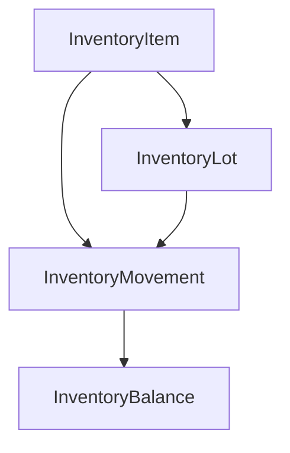

# Módulo Inventory (Estoque)
Última atualização: 2026-02-11
Escopo: blueprint técnico e funcional do MVP de Inventory para implementação futura no backend.
Links relacionados: [Portal](../INDEX.md), [Arquitetura](../01-architecture/ARCHITECTURE.md), [API_CONTRACTS](../03-api/API_CONTRACTS.md), [ADR-002](../01-architecture/ADR/ADR-002-inventory-ledger-balance-and-lots.md), [TODO MVP](../_work/INVENTORY_TODO_MVP.md), [Módulo Health](./HEALTH_VETERINARY_MODULE.md), [Módulo Lactation](./LACTATION_MODULE.md), [Módulo Reproduction](./REPRODUCTION_MODULE.md)

## Status do documento
- Natureza: especificação (blueprint), sem implementação Java nesta tarefa.
- Estado atual do módulo: planejado.
- Objetivo: definir contratos, invariantes e estratégia de consistência para execução incremental.

## Visão geral
⚠️ Blueprint: este documento descreve o comportamento-alvo do módulo. Ele não garante que o código Java já exista ou esteja completo.

O módulo `inventory` existe para controlar estoque por fazenda (`farmId`) com rastreabilidade de entradas/saídas/ajustes, foco em itens sanitários e insumos operacionais.

No MVP planejado, o módulo cobre:
- itens de estoque;
- lotes com validade;
- movimentos (`IN`, `OUT`, `ADJUST`);
- saldo materializado para leitura rápida;
- alertas farm-level (`low-stock`, `expiring`).

Fora do MVP:
- compras/vendas completas;
- financeiro contábil;
- cálculo de custo médio avançado;
- integração orientada a eventos como requisito de consistência.

## Modelo conceitual
Entidades centrais do blueprint:
- `InventoryItem`: metadados e política do item (`trackLot`, `minQuantity`, unidade, categoria).
- `InventoryLot`: lote e validade para itens rastreáveis.
- `InventoryMovement`: ledger imutável (fonte de verdade transacional).
- `InventoryBalance`: saldo materializado para consultas e alertas.



## Regras e invariantes (não negociáveis)
- `farmId` obrigatório em todas as operações.
- `quantity` sempre `> 0`.
- `OUT` não pode gerar saldo negativo.
- `ADJUST` com `adjustDirection=DECREMENT` não pode gerar saldo negativo.
- `trackLot=true` exige `lotId` em `IN`, `OUT` e `ADJUST`.
- `ADJUST` exige `adjustDirection` explícito (`INCREMENT` ou `DECREMENT`).
- `expiresAt` (quando informado) não pode ser anterior à data de entrada do lote.
- `inventory_movement` é imutável após gravação.
- Unicidades mínimas planejadas:
  - `inventory_item (farm_id, name_normalized)`;
  - `inventory_lot (item_id, lot_code)`;
  - `inventory_idempotency (farm_id, idempotency_key)`;
  - `inventory_balance` único por (`farm_id`, `item_id`, `lot_id`) com garantia para `lot_id null`.

## Contratos REST do MVP (planejado)
Base planejada: `/api/goatfarms/{farmId}/inventory`

Padrões obrigatórios:
- segurança por ownership: `@PreAuthorize("@ownershipService.canManageFarm(#farmId)")`;
- paginação por `page`, `size`, `sort`;
- erros/status alinhados ao [API_CONTRACTS](../03-api/API_CONTRACTS.md).

### Items (CRUD mínimo + ativação)
| Método | URL | Finalidade |
|---|---|---|
| `GET` | `/items` | listar itens com filtros (`category`, `active`, `search`) |
| `POST` | `/items` | criar item |
| `GET` | `/items/{itemId}` | detalhar item |
| `PATCH` | `/items/{itemId}` | atualizar metadados do item |
| `PATCH` | `/items/{itemId}/activation` | ativar/desativar item |

Ordenação estável (default):
- `name ASC`, depois `itemId ASC`.

Exemplo curto (ativação/desativação):
- Request:
```json
{
  "active": false
}
```
- Response:
```json
{
  "itemId": 101,
  "active": false
}
```

### Lots
| Método | URL | Finalidade |
|---|---|---|
| `GET` | `/items/{itemId}/lots` | listar lotes por item |
| `POST` | `/items/{itemId}/lots` | criar lote |
| `PATCH` | `/items/{itemId}/lots/{lotId}` | atualizar metadados do lote |

### Movements (ledger)
| Método | URL | Finalidade |
|---|---|---|
| `POST` | `/movements` | registrar `IN`, `OUT` ou `ADJUST` |
| `GET` | `/movements` | listar histórico (`itemId`, `lotId`, `movementType`, `sourceModule`, `from`, `to`) |

Ordenação estável (default):
- `occurredAt DESC`, depois `movementId DESC`.

Exemplo mínimo (POST /movements):
- Headers:
  - `Idempotency-Key: <string>`
- Request:
```json
{
  "itemId": 101,
  "type": "OUT",
  "quantity": 2.0,
  "unit": "DOSE",
  "lotId": 10,
  "occurredAt": "2026-02-11T13:45:00Z",
  "sourceModule": "HEALTH",
  "sourceRef": "healthEvent:5501",
  "notes": "Aplicação em matrizes"
}
```
- Response (exemplo curto):
```json
{
  "movementId": "7a1d3b0e-4ef7-4e9c-9ac2-5e1d5c9c2f10",
  "itemId": 101,
  "lotId": 10,
  "type": "OUT",
  "quantity": 2.0,
  "unit": "DOSE",
  "occurredAt": "2026-02-11T13:45:00Z",
  "balanceAfter": 18.0
}
```

Notas:
- `trackLot` é propriedade do item (servidor valida); o cliente informa `lotId` apenas quando aplicável.

Regra de idempotência (planejada):
- persistir chave/payload (hash) e resposta em `inventory_idempotency` para suportar replay e detectar mismatch.
- header obrigatório: `Idempotency-Key` no `POST /movements`.
- mesma key + mesmo payload lógico: replay idempotente (`200` com mesma resposta de negócio).
- mesma key + payload diferente: `409 Conflict`.
- ausência de key: `400 Bad Request`.

### Stock snapshot
| Método | URL | Finalidade |
|---|---|---|
| `GET` | `/stock` | snapshot paginado de saldo por item/lote (`includeLots`, `referenceDate`) |

Query params (planejado):
- `includeLots` (boolean, default: false)
- `referenceDate` (opcional, default: hoje)
- `page`, `size`

Ordenação estável (default):
- `itemId ASC`.

### Alerts farm-level
| Método | URL | Finalidade |
|---|---|---|
| `GET` | `/alerts/low-stock` | itens abaixo do mínimo |
| `GET` | `/alerts/expiring` | lotes com vencimento próximo (`days`) |

Ordenação estável (default):
- `severity DESC`, depois `itemId ASC`.

Padrão de resposta de alertas (planejado):
```json
{
  "totalPending": 2,
  "alerts": [
    {
      "alertId": "INV_LOW_STOCK:101",
      "type": "LOW_STOCK",
      "severity": "HIGH",
      "itemId": 101,
      "itemName": "Vacina clostridiose",
      "message": "Estoque abaixo do mínimo configurado.",
      "referenceDate": "2026-02-11"
    }
  ]
}
```

## Concorrência e consistência
Estratégia planejada para comando de movimento:
- transação única por comando;
- lock pessimista em saldo com `SELECT ... FOR UPDATE`;
- ordem fixa de lock para reduzir deadlock:
  - lock do item (`inventory_item`) primeiro;
  - depois lock do(s) saldo(s) impactado(s) em `inventory_balance` (quando houver lotes, ordenar por `lotId` asc);
- se a linha de saldo não existir: `upsert` + releitura com lock;
- validação de invariantes antes de gravar ledger;
- gravação em `inventory_movement` e atualização de `inventory_balance` na mesma transação.

Observação de retries:
- retries de cliente/rede devem reutilizar a mesma `Idempotency-Key`.

## Segurança
No blueprint, todos os endpoints farm-level do módulo seguem:
- `@PreAuthorize("@ownershipService.canManageFarm(#farmId)")`.

## Gate de arquitetura (fronteira)
Regra planejada de arquitetura:
- `inventory` não pode importar classes internas de `health`, `milk` e `reproduction`.
- exceção permitida: `sharedkernel`.

Validação sugerida:
- `InventoryBoundaryArchUnitTest`;
- `rg -n "import com\\.devmaster\\.goatfarm\\.(health|milk|reproduction)\\." src/main/java/com/devmaster/goatfarm/inventory`.

## Persistência e performance (planejado)
- `inventory_movement` é fonte de verdade para trilha auditável.
- `inventory_balance` é materializado para leitura rápida (listas, snapshot e alertas).
- Índices planejados para consultas por fazenda, item, lote, período e origem.
- Migrações Flyway ainda não foram criadas nesta tarefa (apenas especificadas no TODO MVP).

## Integrações planejadas (sem acoplamento indevido)
- `Farm`: isolamento estrito por `farmId`.
- `Health`: consumo por `sourceModule=HEALTH` e `sourceRef` textual.
- `Reproduction`: consumo por `sourceModule=REPRODUCTION` e `sourceRef` textual.
- `Milk`: consumo por `sourceModule=MILK` e `sourceRef` textual.

Regra de fronteira:
- sem FK cruzada para tabelas de outros contextos.
- referência de origem apenas por `sourceModule` + `sourceRef`.

## Erros/Status
Status esperados seguem [API_CONTRACTS](../03-api/API_CONTRACTS.md):
- `400`, `401`, `403`, `404`, `409`, `422`, `500`.

## Testes e validação para implementação
Comandos recomendados para DoD técnico:
- `./mvnw.cmd -Dtest=HexagonalArchitectureGuardTest test`
- `./mvnw.cmd -Dtest=InventoryBoundaryArchUnitTest test`
- `./mvnw.cmd test`
- `rg -n "import com\\.devmaster\\.goatfarm\\.(health|milk|reproduction)\\." src/main/java/com/devmaster/goatfarm/inventory`

## Observações
- Este documento define o contrato alvo do módulo Inventory.
- Ajustes de escopo devem atualizar também o [ADR-002](../01-architecture/ADR/ADR-002-inventory-ledger-balance-and-lots.md) e o [TODO MVP](../_work/INVENTORY_TODO_MVP.md).
