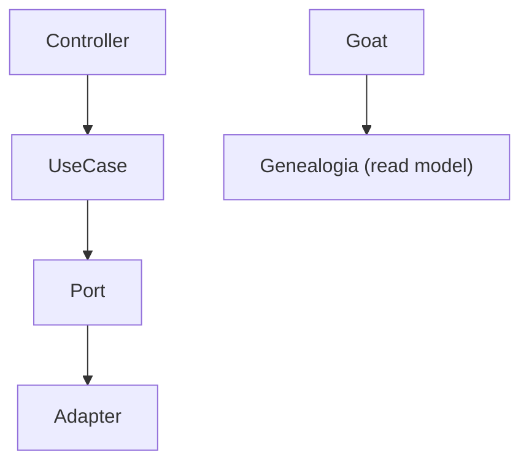

# Arquitetura do Sistema GoatFarm

Este documento descreve a arquitetura técnica do sistema, baseada em Arquitetura Hexagonal (Ports & Adapters) e Domain-Driven Design (DDD).

## 1. Visão Geral (Arquitetura Hexagonal)

O sistema está estruturado para isolar o núcleo da aplicação (Domínio e Regras de Negócio) das dependências externas (Banco de Dados, API Web, Mensageria).

### Fluxo de Controle



#### Diagrama em Texto (ASCII)

```text
[Controller] -> [UseCase] -> [Port] -> [Adapter]

[Goat] -> [Genealogia (read model)]
```

### Estrutura de Camadas

1.  **Application Core (Núcleo)**:
    *   **Ports (Portas)**: Interfaces que definem a comunicação com o mundo externo.
        *   `in`: Use Cases (Casos de Uso) - entrada de comandos.
        *   `out`: Persistence Ports, Event Publishers - saída para infraestrutura.
    *   **Business (Implementação)**: Serviços que implementam os Use Cases e contém a lógica de negócio.
    *   **Domain Models (BO/VO)**: Objetos de Negócio e Value Objects puros.

2.  **Adapters (Adaptadores)**:
    *   **Primary (Driving)**: Controladores REST (`api/controller`) que recebem requisições HTTP e chamam os Use Cases.
    *   **Secondary (Driven)**: Implementações de persistência (`infrastructure` ou `repository` direto) e consumidores de mensagens.

## 2. Estrutura de Módulos

O projeto é modularizado por domínio funcional:

*   `address`: Gestão de endereços.
*   `authority`: Gestão de usuários, roles e autenticação.
*   `events`: Sistema de eventos (nascimento, vacinação, etc.) e mensageria.
*   `farm`: Agregado raiz da Fazenda (`GoatFarm`).
*   `goat`: Gestão de animais (`Goat`).
*   `genealogy`: Projeção de árvore genealógica (Read-Only).
*   `milk`: Gestão de produção de leite.
*   `phone`: Gestão de telefones.
*   `infrastructure`: Configurações globais e adaptadores genéricos.

## 3. Padrões de Implementação

### API REST
*   **Base URL**: `/api` (ex: `/api/goatfarms`, `/api/auth`).
*   **DTOs**: Objetos exclusivos para transferência de dados externos, mapeados via MapStruct.
*   **Versioning**: Atual v1 (implícito na URL base).

### Tratamento de Exceções
O sistema utiliza um `GlobalExceptionHandler` para padronizar erros:
*   `ResourceNotFoundException` (404): Recurso não encontrado.
*   `InvalidArgumentException` (400): Erro de validação de negócio.
*   `UnauthorizedException` (401) / `ForbiddenException` (403): Segurança.
*   `DuplicateEntityException` (409): Conflito de dados únicos.
*   `DatabaseException`: Erros de integridade.

### Padrão de Persistência
*   **Spring Data JPA**: Repositórios estendem `JpaRepository`.
*   **Lazy Loading**: Relacionamentos pesados (`Address`, `Phone`, `User`) são `LAZY` por padrão para evitar overhead.
*   **Projeções**: Consultas otimizadas com `JOIN FETCH` para cenários específicos (ex: Genealogia).
