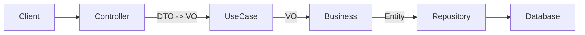

# Módulo Lactation

## Sumário
1. [Overview](#overview)
2. [Regras de Domínio](#regras-de-domínio)
3. [Endpoints](#endpoints)
4. [DTOs, VOs e Entidades](#dtos-vos-e-entidades)
5. [Fluxo Hexagonal](#fluxo-hexagonal)
6. [Erros e Exceções](#erros-e-exceções)
7. [Como testar](#como-testar)
8. [Próximos Passos](#próximos-passos)

## Overview
Este módulo gerencia o ciclo de vida produtivo das cabras, controlando a abertura e o encerramento de lactações (períodos em que o animal está produzindo leite). É essencial para garantir a consistência dos registros de produção leiteira e o histórico reprodutivo do animal.

## Regras de Domínio

### 1. Unicidade de Lactação Ativa
*   Uma cabra só pode ter **uma** lactação com status `ACTIVE` por vez.
*   Tentativas de abrir uma nova lactação enquanto existe uma ativa resultarão em erro (`ValidationException`).

### 2. Abertura de Lactação (Open)
*   **Status Inicial:** `ACTIVE`.
*   **Data de Início (`startDate`):** Obrigatória e não pode ser futura.
*   **Data de Fim (`endDate`):** Inicializada como `null`.

### 3. Encerramento de Lactação (Dry/Close)
*   **Ação:** Transforma o status de `ACTIVE` para `CLOSED`.
*   **Data de Fim (`endDate`):** Obrigatória, não pode ser nula, e deve ser posterior ou igual à `startDate`.
*   **Consistência:** Apenas lactações ativas podem ser encerradas.

## Endpoints

**Base Path:** `/api/goatfarms/{farmId}/goats/{goatId}/lactations`

| Método | Rota | Descrição | Status Codes | DTOs (Request/Response) |
|--------|------|-----------|--------------|-------------------------|
| **POST** | `/` | Abre uma nova lactação (Início do ciclo). | `201 Created` | `LactationRequestDTO` -> `LactationResponseDTO` |
| **PATCH** | `/{id}/dry` | Encerra uma lactação ativa (Secagem). | `200 OK` | `LactationDryRequestDTO` -> `LactationResponseDTO` |
| **GET** | `/active` | Busca a lactação atualmente ativa. | `200 OK` | N/A -> `LactationResponseDTO` |
| **GET** | `/{id}` | Busca detalhes de uma lactação por ID. | `200 OK` | N/A -> `LactationResponseDTO` |
| **GET** | `/` | Lista histórico de lactações (paginado). | `200 OK` | N/A -> `Page<LactationResponseDTO>` |

## DTOs, VOs e Entidades

### DTOs (Data Transfer Objects)
*   **LactationRequestDTO**: Usado para abrir lactação (`startDate`, `pregnancyStartDate`).
*   **LactationDryRequestDTO**: Usado para secagem (`endDate`, `dryReason`).
*   **LactationResponseDTO**: Retorno padrão para clientes da API.

### VOs (Value Objects - Business Layer)
*   **LactationRequestVO**: Objeto de negócio para criação.
*   **LactationResponseVO**: Objeto de negócio para resposta.

### Entity (Persistência)
*   **Lactation**: Entidade JPA mapeada para a tabela `lactation`.
    *   `id`: Long (PK)
    *   `farmId`: Long (Tenant)
    *   `goatId`: String (FK lógica)
    *   `status`: Enum (`ACTIVE`, `CLOSED`)

## Fluxo Hexagonal

1.  **Controller**: `LactationController` recebe a requisição HTTP e valida o DTO.
2.  **Mapper**: Converte DTO para VO.
3.  **UseCase**: `LactationCommandUseCase` (escrita) ou `LactationQueryUseCase` (leitura).
4.  **Business**: `LactationBusiness` aplica regras de domínio (ex: verificar se já existe lactação ativa).
5.  **Repository**: `LactationRepository` persiste os dados.

## Erros e Exceções

*   **404 Not Found**: Se a cabra ou a lactação não forem encontradas.
*   **400 Bad Request**: Erros de validação (ex: data futura, campos nulos).
*   **422 Unprocessable Entity** (ou 400 mapeado): Regras de negócio violadas (ex: já existe lactação ativa, data de fim anterior ao início).

## Como testar

Sequência sugerida para testes manuais (Postman):

1.  **Criar Lactação**: `POST /api/goatfarms/1/goats/G001/lactations` com corpo `{ "startDate": "2023-01-01" }`.
2.  **Verificar Ativa**: `GET /api/goatfarms/1/goats/G001/lactations/active`.
3.  **Tentar Criar Duplicada**: Repetir o passo 1 (deve falhar).
4.  **Encerrar (Secar)**: `PATCH /api/goatfarms/1/goats/G001/lactations/{id}/dry` com corpo `{ "endDate": "2023-10-01" }`.
5.  **Verificar Histórico**: `GET /api/goatfarms/1/goats/G001/lactations`.

## Próximos Passos
*   Implementar endpoint de "Sumário de Lactação" com totais de leite produzido (dependência do módulo `MilkProduction`).
*   Adicionar validações de consistência com datas de parto (módulo `Genealogy` ou `Reproduction`).
