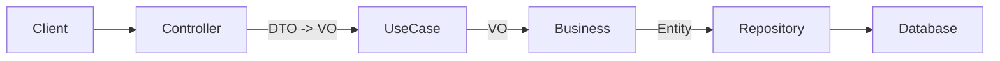

# Módulo Lactation

## Visão Geral
Este módulo é responsável pelo ciclo de vida produtivo das cabras, gerenciando a abertura e o encerramento de lactações (períodos em que o animal está produzindo leite). É fundamental para garantir a consistência dos registros de produção leiteira.

## Endpoints do CRUD

O módulo expõe uma API RESTful completa para gerenciamento das lactações.
**Base Path:** `/api/goatfarms/{farmId}/goats/{goatId}/lactations`

| Método | Endpoint | Descrição |
|--------|----------|-----------|
| **POST** | `/` | Abre uma nova lactação (Início do ciclo produtivo). |
| **PATCH** | `/{id}/dry` | Encerra uma lactação ativa (Secagem do animal). |
| **GET** | `/active` | Busca a lactação atualmente ativa para a cabra. |
| **GET** | `/{id}` | Busca os detalhes de uma lactação específica por ID. |
| **GET** | `/` | Lista o histórico de lactações de forma paginada. |

## Segurança e Autorização

- Todos os endpoints de lactação são privados e exigem token JWT válido.
- Chamadas sem token para qualquer rota de lactação retornam **401 Unauthorized**.
- Usuários com **ROLE_ADMIN** têm acesso total, em qualquer fazenda.
- Usuários com **ROLE_OPERATOR** ou **ROLE_FARM_OWNER** só acessam dados da fazenda se forem proprietários (`ownershipService.isFarmOwner(farmId)`).
- Quando o token é válido mas o usuário não é proprietário da fazenda, a API retorna **403 Forbidden**.

## Regras de Domínio

### 1. Unicidade de Lactação Ativa
*   Uma cabra só pode ter **uma** lactação com status `ACTIVE` por vez.
*   Tentativas de abrir uma nova lactação enquanto existe uma ativa resultarão em erro (`ValidationException`).

### 2. Abertura de Lactação (Open)
*   **Status Inicial:** `ACTIVE`.
*   **Data de Início (`startDate`):** Obrigatória e não pode ser futura.
*   **Data de Fim (`endDate`):** Inicializada como `null`.

### 3. Encerramento de Lactação (Dry/Close)
*   **Ação:** Transforma o status de `ACTIVE` para `CLOSED`.
*   **Data de Fim (`endDate`):** Obrigatória, não pode ser nula, e deve ser posterior ou igual à `startDate`.
*   **Consistência:** Apenas lactações ativas podem ser encerradas.

## Estrutura de Dados

### Lactation (Entity)
*   `id`: Identificador único.
*   `farmId`: Identificador da fazenda (Multi-tenancy).
*   `goatId`: Identificador da cabra.
*   `status`: `ACTIVE` ou `CLOSED`.
*   `startDate`: Data de início da lactação.
*   `endDate`: Data de fim (secagem).
*   `pregnancyStartDate`: (Opcional) Data de início de prenhez associada.
*   `dryStartDate`: (Opcional) Data prevista ou efetiva de secagem.

| Método | Rota | Descrição | Status Codes | DTOs (Request/Response) |
|--------|------|-----------|--------------|-------------------------|
| **POST** | `/` | Abre uma nova lactação (Início do ciclo). | `201 Created` | `LactationRequestDTO` -> `LactationResponseDTO` |
| **PATCH** | `/{id}/dry` | Encerra uma lactação ativa (Secagem). | `200 OK` | `LactationDryRequestDTO` -> `LactationResponseDTO` |
| **GET** | `/active` | Busca a lactação atualmente ativa. | `200 OK` | N/A -> `LactationResponseDTO` |
| **GET** | `/{id}` | Busca detalhes de uma lactação por ID. | `200 OK` | N/A -> `LactationResponseDTO` |
| **GET** | `/` | Lista histórico de lactações (paginado). | `200 OK` | N/A -> `Page<LactationResponseDTO>` |

## DTOs, VOs e Entidades

### DTOs (Data Transfer Objects)
*   **LactationRequestDTO**: Usado para abrir lactação (`startDate`, `pregnancyStartDate`).
*   **LactationDryRequestDTO**: Usado para secagem (`endDate`, `dryReason`).
*   **LactationResponseDTO**: Retorno padrão para clientes da API.

### VOs (Value Objects - Business Layer)
*   **LactationRequestVO**: Objeto de negócio para criação.
*   **LactationResponseVO**: Objeto de negócio para resposta.

### Entity (Persistência)
*   **Lactation**: Entidade JPA mapeada para a tabela `lactation`.
*   `id`: Long (PK)
*   `farmId`: Long (Tenant)
*   `goatId`: String (FK lógica)
*   `status`: Enum (`ACTIVE`, `CLOSED`)

## Fluxo Hexagonal

1.  **Controller**: `LactationController` recebe a requisição HTTP e valida o DTO.
2.  **Mapper**: Converte DTO para VO.
3.  **UseCase**: `LactationCommandUseCase` (escrita) ou `LactationQueryUseCase` (leitura).
4.  **Business**: `LactationBusiness` aplica regras de domínio (ex: verificar se já existe lactação ativa).
5.  **Repository**: `LactationRepository` persiste os dados.

## Erros e Exceções

*   **404 Not Found**: Se a cabra ou a lactação não forem encontradas.
*   **400 Bad Request**: Erros de validação (ex: data futura, campos nulos).
*   **422 Unprocessable Entity** (ou 400 mapeado): Regras de negócio violadas (ex: já existe lactação ativa, data de fim anterior ao início).

## Como testar

Sequência sugerida para testes manuais (Postman):

1.  **Criar Lactação**: `POST /api/goatfarms/1/goats/G001/lactations` com corpo `{ "startDate": "2023-01-01" }`.
2.  **Verificar Ativa**: `GET /api/goatfarms/1/goats/G001/lactations/active`.
3.  **Tentar Criar Duplicada**: Repetir o passo 1 (deve falhar).
4.  **Encerrar (Secar)**: `PATCH /api/goatfarms/1/goats/G001/lactations/{id}/dry` com corpo `{ "endDate": "2023-10-01" }`.
5.  **Verificar Histórico**: `GET /api/goatfarms/1/goats/G001/lactations`.

## Próximos Passos

- Implementar endpoint de "Sumário de Lactação" com totais de leite produzido (dependência do módulo `MilkProduction`).
- Adicionar validações de consistência com datas de parto (módulo `Genealogy` ou `Reproduction`).

## Integração com Milk Production

O módulo de Produção de Leite (`MilkProduction`) depende diretamente deste módulo. O registro de produção leiteira geralmente requer uma lactação ativa (embora a validação estrita possa variar conforme a configuração da fazenda, a regra de negócio sugere vínculo).

## Recomendações de Manejo

- Em muitos manejos, a **secagem** é planejada aproximadamente **90 dias após a cobertura** ou cerca de **60 dias antes da data prevista de parto**.
- Essas referências de 90/60 dias são **recomendações de manejo** e não bloqueios da API: o sistema apenas valida consistência básica de datas (não futuras, `endDate` não anterior a `startDate`) e permite que a fazenda ajuste as datas conforme sua realidade.

### 4. Secagem manual (nao automatizada)
*   A secagem e uma decisao do proprietario. O sistema **nao** encerra lactacao automaticamente com base na confirmacao de prenhez.
*   A confirmacao de prenhez pode orientar o manejo, mas a data de secagem continua sendo informada manualmente via PATCH.
