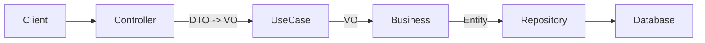

# Módulo Milk Production

## Sumário
1. [Overview](#overview)
2. [Regras de Domínio](#regras-de-domínio)
3. [Endpoints](#endpoints)
4. [DTOs, VOs e Entidades](#dtos-vos-e-entidades)
5. [Fluxo Hexagonal](#fluxo-hexagonal)
6. [Erros e Exceções](#erros-e-exceções)
7. [Como testar](#como-testar)
8. [Próximos Passos](#próximos-passos)

## Overview
Este módulo gerencia a produção diária de leite, permitindo o registro de ordenhas, controle de volume e atualizações. É fortemente acoplado ao conceito de "Cabra" e "Lactação", embora possa operar de forma independente em termos de CRUD básico.

## Regras de Domínio

### 1. Imutabilidade de Identificadores
*   Uma vez criada, uma produção de leite não pode ter sua data ou turno (`shift`) alterados via PATCH, para garantir a integridade de registros históricos.
*   Para corrigir data/turno, deve-se excluir e recriar o registro.

### 2. Validação de Escopo (Tenancy)
*   Todas as operações exigem `farmId` e `goatId`.
*   Não é possível manipular produções apenas pelo ID global; o sistema valida se o ID pertence à cabra e fazenda informadas.

### 3. Edição Parcial
*   Apenas o volume (`volumeLiters`) e observações (`notes`) são editáveis após a criação.

## Endpoints

**Base Path:** `/api/goatfarms/{farmId}/goats/{goatId}/milk-productions`

| Método | Rota | Descrição | Status Codes | DTOs (Request/Response) |
|--------|------|-----------|--------------|-------------------------|
| **POST** | `/` | Cria registro de produção. | `201 Created` | `MilkProductionRequestDTO` -> `MilkProductionResponseDTO` |
| **GET** | `/` | Lista produções (filtros: `from`, `to`). | `200 OK` | N/A -> `Page<MilkProductionResponseDTO>` |
| **GET** | `/{id}` | Busca detalhes de uma produção. | `200 OK` | N/A -> `MilkProductionResponseDTO` |
| **PATCH** | `/{id}` | Atualiza volume/notas. | `200 OK` | `MilkProductionUpdateRequestDTO` -> `MilkProductionResponseDTO` |
| **DELETE** | `/{id}` | Remove um registro. | `204 No Content` | N/A |

## DTOs, VOs e Entidades

### DTOs
*   **MilkProductionRequestDTO**: Criação (`date`, `shift`, `volumeLiters`).
*   **MilkProductionUpdateRequestDTO**: Atualização (`volumeLiters`, `notes`).
*   **MilkProductionResponseDTO**: Leitura completa.

### VOs (Business Layer)
*   **MilkProductionRequestVO**: Dados de entrada normalizados.
*   **MilkProductionResponseVO**: Dados de saída enriquecidos.

### Entity
*   **MilkProduction**:
    *   `id`: Long (PK)
    *   `date`: LocalDate
    *   `shift`: Enum (`MORNING`, `AFTERNOON`, `EVENING`)
    *   `volumeLiters`: Double
    *   `goatId`: String
    *   `farmId`: Long

## Fluxo Hexagonal

## Erros e Exceções

*   **404 Not Found**: Registro não encontrado ou não pertence à cabra/fazenda informada.
*   **400 Bad Request**: Volume negativo, data inválida.
*   **409 Conflict** (Potencial): Se houver restrição de unicidade por data/turno (depende da configuração).

## Como testar

Sequência sugerida para testes manuais (Postman):

1.  **Registrar Ordenha**: `POST .../milk-productions` com `{ "date": "2023-10-01", "shift": "MORNING", "volumeLiters": 2.5 }`.
2.  **Listar**: `GET .../milk-productions?from=2023-10-01`.
3.  **Corrigir Volume**: `PATCH .../milk-productions/{id}` com `{ "volumeLiters": 2.8 }`.
4.  **Verificar Detalhe**: `GET .../milk-productions/{id}`.
5.  **Excluir**: `DELETE .../milk-productions/{id}`.

## Próximos Passos
*   Relatórios de produtividade (soma mensal, média diária).
*   Integração automática com o status de lactação (impedir registro se lactação fechada).
