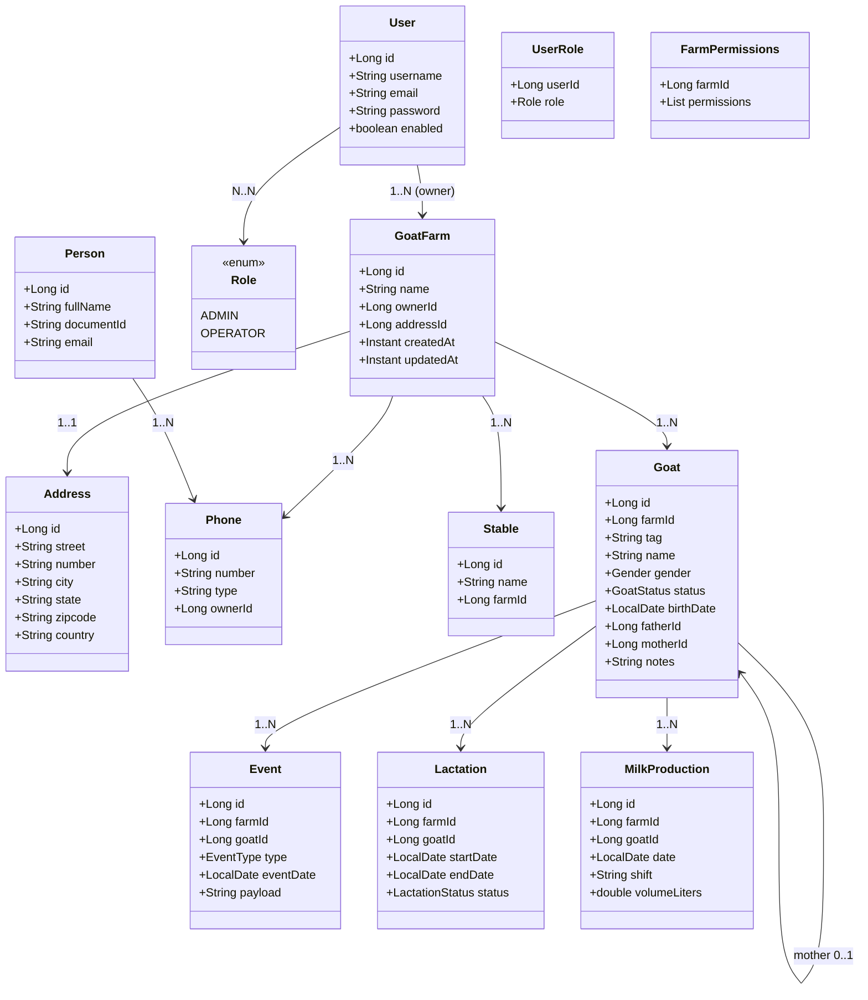

> **NOTA HISTÓRICA**: Este arquivo é mantido para fins de registro histórico. Seu conteúdo pode não refletir o estado atual do código ou da arquitetura.
> Última verificação: 2026-01-11

# Entidades e Relacionamentos — Diagrama de Classes (Base CapriGestor)

Este documento lista entidades, atributos essenciais e relacionamentos com cardinalidades para facilitar a criação do diagrama de classes. Foco nos módulos atuais: `farm`, `goat`, `genealogy`, `events`, `authority` e itens compartilhados.

Observação: todas as entidades com dados por fazenda devem conter `farmId` para multi-tenancy forte.

---

## Farm

- GoatFarm
  - id
  - name
  - ownerId (User ou Person)
  - addressId
  - createdAt, updatedAt
  - Observações: uma fazenda agrega seus recursos (endereços, telefones, estábulos, animais, eventos)

- Address
  - id
  - street, number, neighborhood, city, state, zipcode
  - country

- Phone
  - id
  - number
  - type (MOBILE, LANDLINE)
  - ownerId (Person/GoatFarm)

- Stable (opcional)
  - id
  - name
  - farmId

Relacionamentos (Farm)
- GoatFarm 1 — 1 Address
- GoatFarm 1 — N Phone
- GoatFarm 1 — N Stable
- GoatFarm 1 — N Goat

---

## Authority (Usuários e Permissões)

- User
  - id
  - username, email
  - password (write-only)
  - enabled

- Role (enum)
  - ADMIN, OPERATOR

- UserRole (tabela de junção, se necessário)
  - userId
  - role

- FarmPermissions (VO/DTO para exposição)
  - farmId
  - permissions (lista de ações por módulo)

Relacionamentos (Authority)
- User N — N Role (via UserRole)
- User 1 — N GoatFarm (ownership) [ou GoatFarm.ownerId → User]

---

## Goat

- Goat
  - id
  - farmId
  - tag (brinco), name
  - gender (enum: MALE, FEMALE)
  - status (enum: PO, PA, PC, etc.)
  - birthDate
  - fatherId (Goat.id)
  - motherId (Goat.id)
  - notes

Relacionamentos (Goat)
- GoatFarm 1 — N Goat
- Goat (0..1 father) — 1 Goat (MALE)
- Goat (0..1 mother) — 1 Goat (FEMALE)
  - Invariantes: `fatherId` e `motherId` devem referenciar cabras da mesma fazenda (`farmId` igual)

---

## Genealogy

- Uso via auto-relacionamento em Goat (fatherId/motherId)
- Opcionalmente uma entidade Genealogy pode ser mantida para histórico/consulta

---

## Events

- Event
  - id
  - farmId
  - goatId
  - type (enum: BIRTH, COVERAGE, PARTURITION, VACCINATION, WEIGHT, TREATMENT)
  - eventDate
  - payload (campos específicos conforme tipo: weight, vaccineName, notes)

Relacionamentos (Events)
- Goat 1 — N Event
- GoatFarm 1 — N Event (derivado via `farmId`, invariantes de integridade)

---

## Milk (Lactation & Production)

- Lactation
  - id
  - farmId
  - goatId
  - startDate
  - endDate
  - status (ACTIVE, CLOSED)
  - pregnancyStartDate
  - dryStartDate

- MilkProduction
  - id
  - farmId
  - goatId
  - date
  - shift (MORNING, AFTERNOON, NIGHT)
  - volumeLiters
  - notes

Relacionamentos (Milk)
- Goat 1 — N Lactation
- Goat 1 — N MilkProduction
- Lactation 1 — N MilkProduction (Lógico: produção ocorre durante lactação)

---

## Shared

- Person (se utilizado)
  - id
  - fullName, documentId, email

Relacionamentos (Shared)
- Person 1 — N Phone
- GoatFarm.ownerId → Person.id (se modelo usar Person em vez de User)

---

## Cardinalidades e Invariantes (Resumo)

- GoatFarm 1..1 Address
- GoatFarm 1..N Phone
- GoatFarm 1..N Stable
- GoatFarm 1..N Goat
- Goat 0..1 father → Goat
- Goat 0..1 mother → Goat
- Goat 1..N Event
- User N..N Role (UserRole)
- GoatFarm 1..1 owner (User ou Person)

Invariantes críticos
- `Goat.farmId = GoatFarm.id` (pertencimento)
- `Event.farmId = GoatFarm.id` e `Event.goatId` deve referenciar `Goat` da mesma fazenda
- `Goat.fatherId` e `Goat.motherId` referenciam cabras com `gender` adequado (pai MALE, mãe FEMALE)
- Exclusão/soft delete deve preservar integridade de genealogia e eventos

---

## Mermaid (opcional para colar em diagrama)

---

## Notas finais

- Ajuste nomes/atributos conforme os DTOs/entidades efetivas do projeto.
- Para fins de diagrama, você pode omitir VO/DTO e focar nas entidades persistentes.